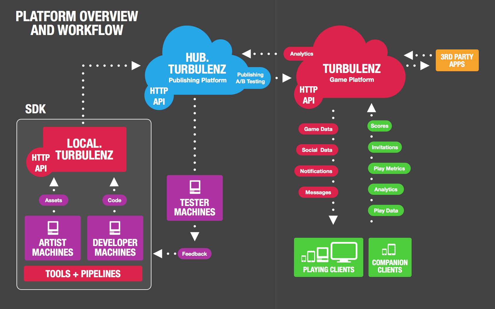
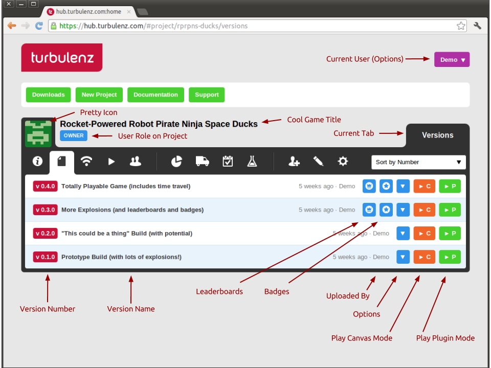

.. index::
    single: Introduction

.. highlight:: javascript

.. _hub_introduction:

------------
Introduction
------------

Welcome to the Turbulenz Hub User Guide!
The aim of this guide is to show you how to use the Turbulenz Hub to upload, test and demo your game to team members, testers and other third parties around the world.
This guide will take you through how to configure your game to be '**Hub ready**' and demonstrate the process of deploying your game to Turbulenz' live staging server known as the 'Hub'.
The guide is structured around the processes that you are likely to need to be performing when using the Hub on a daily basis.
It also includes a description of the controls available and a troubleshooter to help you avoid common pitfalls when getting started.

In This Guide
-------------

**Document Sections**

Here is a summary of the topics covered in each section:

:ref:`what_is_the_hub`

    **Find out what the Hub is all about:** An integral part of the Turbulenz publishing process; the Hub provides the stepping stone enabling you to get your content hosted online.
    This section describes the features the technology provides, at what stage of development to start using it and an overview of where it fits in with other Turbulenz technologies.

:ref:`hub_how_do_i`

    **I need to perform a certain Hub task:** You are using the Hub as an admin, developer, tester and need to configure/run a game you have access to.
    These step-by-step guides will help you to manage your project and account and find out information on how they are configured.

:ref:`hub_troubleshooting`

    **I can't get it to work:** If you are encountering problems when using the Hub, check out this section to see if you can find a solution to your problem.
    It covers the possible pitfalls you might encounter and offers you suggestions to help you get going again.

**Assumptions**

* You have a basic understanding of what 'Turbulenz' is as a company and range of products.
* You understand that Turbulenz technology products allow developers to create games that run online on a range of platforms.
* You are have read the :ref:`Getting Started Guide <getting_started_guide>` and are aware of the :ref:`Turbulenz Local Server <local_introduction>`. If not, please see the Turbulenz documentation.
* You are familiar with developing an application/game using Turbulenz technology OR have access to a Turbulenz powered application/game that you have permission to use in conjunction with the Hub.

.. NOTE::

    Some parts of this guide (e.g. :ref:`how_do_i_prepare_my_project`) may require you to have an understanding how your application/game is structured including build processes and tools.
    The majority of this guide is intended for users of the Hub service, including third parties and will not require knowledge of development processes as a whole.

.. highlight:: javascript

.. _what_is_the_hub:

----------------
What is the Hub?
----------------

*Description*

    This section describes the Turbulenz technology known as the 'Hub', what its purpose is and how you can use it to make online games.

*Read This Section*

* If you don't know what the Hub is and want to find out.
* If you are interested in how the Hub can be used to help publish your games.
* If you are using the local server and want to learn how to stage your game in a live environment.

*Rewind*

.. Relevant to this section

* :ref:`hub_introduction`

*Fast Forward*

.. In this section

* :ref:`a-brief-introduction-to-the-turbulenz-hub`
* :ref:`a-visual-guide`

.. Next section

* :ref:`hub_how_do_i`

.. _a-brief-introduction-to-the-turbulenz-hub:

A Brief Introduction to the Hub
-------------------------------

    This is a diagram showing where the Hub as part of the Turbulenz platform.

The Turbulenz Hub or 'Hub' is one of a number of products and services provided by Turbulenz to assist in developing and publishing games online with Turbulenz.
Essentially it is a staging environment and management tool to give selected users access to your uploaded game and allowing them to test, demonstrate and evaluate versions of your game in a 'real world' scenario.
The diagram above shows where the Hub is positioned within the family of Turbulenz products.

The Hub provides developers with:

* A staging server to host and test builds of their game in a remote environment.
* A mechanism for allowing and controlling access to trusted parties of their pre-released game.
* The ability to play their game online and test real-world performance, latency and distribution channels, whilst gathering metrics.
* An end-to-end mechanism for self-publishing, enabling developers to create content, test compatibility and gameplay before publishing.
* A mechanism for publishing a limited access preview version of their game before and alongside a public release.
* The ability to run A/B tests on their published game.
* The ability to view metrics for their published game and tests.

Here is a summary of the process of using the Hub:

* The development lifecycle starts with programmers and artists contributing to the game project.
* They create the game and its content with the tools provided in the Turbulenz SDK.
* Using the local server as part of their development environment they can prepare games, tests and examples ready to be shared with other parties.
* At various stages of development, pre-alpha, alpha, beta, they can use the local server to 'Deploy' a version of their work to the Hub.
* Once successfully uploaded, it can be played and tested by internal/external teams remotely, in a live environment, e.g. external testing houses.
* When a suitable release candidate is complete and has been approved, it can be published from the Hub to the main Turbulenz game site.

**How does the Hub work with other Turbulenz products?**

Here is a quick overview of the other Turbulenz services:

    :Turbulenz Local Server: Available as part of the Turbulenz SDK. The local development server, a combined package of APIs and web server, can be run on an individual's machine or local company network allowing games to be developed and tested in-house.
    :Turbulenz game site: (Represented by the red cloud) - The Turbulenz website, where users can log-on, play games, interact with other users and share their gaming experience.

The Hub exists as a stage between the local server and the game site.
You can **'Deploy'** from the local server to the Hub and **'Publish'** from the Hub to the game site.

Deploying works by:

* Collecting a list of files to upload, known as the 'Deploy Files'. This should include only the files essential for playing the game (they are stored on the Hub server).
* Signing up for an account on the Hub and creating or being added to a project.
* Connecting to the Hub from the local server.
* Selecting a version number and text for the project to deploy (Or choosing an existing one).
* Uploading and validating the data.
* Logging onto the Hub and playing the deployed game.
* Giving access to other trusted parties.

.. NOTE::

    Version numbers need to be url-safe. Try a standard form such as 0.1.0 or a date 2007-03-13.

The details of the publishing process will be made available in the near future.
Turbulenz intends to provide a mechanism for technically approving content, self-age rating, etc.

**Who is the Hub intended for?**

The Hub is the central location for accessing your game in development prior to releasing to the public.
The projects that are hosted on the Hub only allow access to trusted parties for that have a role to play in developing the game.
All user's on the Hub can be invited to a take a *role* on a project by the owner.
The role categories are as follows:

.. _hub_user_administrators:

.. topic:: Administrators

    The overall administrators of a project (similar abilities as the project owner).
    They have overall responsibility of configuring and submitting the project for publishing.
    It is advised that the group of administrators is kept small.
    Most day-to-day activities can be done with a developer account.

    They can:

    * Add/Remove project members
    * Edit project configuration
    * Lock/Delete a project
    * Play any version of the project
    * Deploy a version of a project to the Hub
    * Publish a version of the project to the Turbulenz game site
    * View the feed
    * View who played any of the versions on the Hub and for how long.
    * View metrics about a deployed project
    * Run A/B tests

    Ideal for:

    * Studio Managers
    * Project Managers
    * Producers
    * Developer Directors

.. _hub_user_developers:

.. topic:: Developers

    Members of the main development team.
    They could be part of a central team or remote developers who require the ability to contribute to the project.
    They have the ability to maintain versions of the project, but are unable to add team members.

    They can:

    * View project members
    * Play any version of the project
    * Deploy a version of a project
    * View the feed
    * View who played any of the versions on the Hub and for how long.
    * View metrics about a deployed project

    They can't:

    * Edit project configuration
    * Add/Remove members
    * Publish any version of the game
    * Run A/B tests

    Ideal for:

    * Development Team Members

.. _hub_user_testers:

.. topic:: Testers

    Testers is the group of users that require 'read only' access to the project.
    They can play *all* versions of the game without the management responsibilities.
    Their role on a project allows them to access uploaded versions to test and provide feedback.
    A useful role for remote testing teams; they require only access to the Hub to playtest a project version.
    They will require the Turbulenz Engine if they intend to test plugin configurations and a canvas (2D/3D) compatible browser to test canvas configurations.

    They can:

    * View project members
    * Play any version of the project
    * View the feed
    * View who played any of the versions on the Hub and for how long.

    They can't:

    * Edit project configuration
    * Edit version configuration
    * Add/Remove members
    * Deploy to the project
    * Publish any version of the game
    * View metrics
    * Run A/B tests

    Ideal for:

    * Internal Testers
    * Trusted Colleagues
    * QA Team Members

.. _hub_user_guests:

.. topic:: Guests

    Guests are the subset of people that you want to be able to allow pre-release access to your game, prior to launch.
    This could be to provide feedback, trial gameplay or just so they can see what you've been working on!
    Guests can be given access to specific versions and their access can be retracted whenever required.

    They can:

    * Play a specific version of a project
    * View the basic information

    They can't:

    * View the activity on the project
    * View/Play any other versions than the ones made visible to them
    * Edit project configuration
    * Edit version configuration
    * Add/Remove members
    * Deploy to the project
    * Publish any version of the game
    * View metrics
    * Run A/B tests

    Ideal for:

    * Journalists
    * Friends
    * Family

.. NOTE::

    Invites to a project can be made by email, but the recipient needs to have an account on the Hub to join the project.
    For more information see the :ref:`hub_how_do_i` section.

.. _a-visual-guide:

A Visual Guide
--------------

    This figure shows the typical layout of the Hub.

|info icon| **Info tab:** Look at some basic information about your project.

|versions icon| **Versions tab:** Control and run any version uploaded to your project.

|feed icon| **Feed tab:** View the project activity.

|play feed icon| **Play Feed tab:** View who played any of the versions on the Hub and for how long.

|members icon| **Members tab:** View the project members and their roles.

|metrics icon| **Metrics tab:** View and export game site metrics for your project at a game, version and test variation level.

|publish icon| **Publish tab:** Publish a teaser or project version to the game site, and set preview and default versions.

|preview icon| **Preview tab:** View and edit the list of game site users who will have access to the published game preview.

|ab testing icon| **A/B Testing tab:** Create and monitor A/B tests for your published game.

.. |ab testing icon| image:: img/hub-test-icon.png

|feed moderation icon| **Feed Moderation tab:** Delete flagged game feed posts, or clear the flag.

|add member icon| **Add Member tab:** Add a member to your Hub project.

|edit icon| **Edit tab:** Edit project information for the Hub and the game site.

|settings icon| **Settings tab:** Edit project settings for the Hub.

.. highlight:: javascript

.. _hub_how_do_i:

---------
How do I?
---------

*Description*

    This section provides step-by-step walkthroughs designed to guide you through the process of performing certain tasks on the Hub.
    It starts with the basics of Hub usage and describes some of the more complex tasks later on.
    It is important to be aware that this information will be updated in the future.
    Please check back to find out if the steps are any different in newer releases.

*Read This Section*

* If you are new to the Hub and want to know how to perform the basic tasks.
* If you require step-by-step instructions for using the Hub.

.. In this section

.. _how_do_i_prepare_my_project:

How do I ... prepare my project for the Hub?
--------------------------------------------

In order to 'Deploy' your project on the Hub you will require:

* The latest Turbulenz SDK
* A *debug* or *release* build of your project (See :ref:`Turbulenz Getting Started Guide <getting_started_guide>`)
* A list of the files required to run your project (e.g. assets, images, css, JavaScript)
* A mapping table file (See Turbulenz Getting Started Guide)
* An account on the Hub
* Ownership of a new project OR membership of an existing project in the Hub (as either a developer, admin or owner)

The first stage of deployment is to make sure you are able to run your game on the local server.
This will require you to configure the settings of your local project (the settings will be used in the deployment to the Hub).
You will need to complete these steps locally:

1) Install the latest SDK on your development machine.
2) Run the local server.
3) Add a new game to your local server (If you have not already done so).
4) Select the base directory of your project as the root folder.
   This is usually the directory where your built *debug* and *release* files are located.
5) Select a title for your project.
   This title can vary from the title used on the Hub, but it should help you identify the project locally.
6) Select a slug for your project.
   The slug is the unique part of the URL that your game will be accessible from. See :ref:`choosing a slug <local_choosing_a_slug>`.
7) Select a plugin main for your project.
   The plugin main is the plugin executable that the Hub will attempt to run for your game.
   For the purpose of development, the Hub allows you specify a HTML file to upload, allowing your interaction with custom development elements e.g. controls and information.
   For publishing to the game site however, this must be a TZJS (<name>.tzjs) file containing your processed game.
8) Select a canvas main for your project.
   The canvas main is the canvas executable that the Hub will attempt to run for your game.
   As with the plugin main, for the purpose of development, the Hub allows you specify a HTML file to upload as the canvas main.
   For publishing to the game site, this must be a canvas JS (<name>.canvas.js) file containing your processed game.
9) Select a mapping_table.json.
   A mapping table is the mapping of your source asset names to deployed Turbulenz assets.
   This includes files such as geometries, textures, sounds etc.
   It is an essential step in the process of deployment to the Hub.
10) Add a list of deploy files for your project.
    These are the files that will be uploaded to the Hub and accessible to the game.
11) Specify whether or not your game supports a multiplayer mode.
12) Specify the aspect ratio to be used for your game on the Turbulenz game site.
13) Specify the latest Turbulenz Engine version that your game is compatible with.
    This engine version will be checked for existence on the Hub and then associated with your game.
14) Try playing your game from the local server.
    In the metrics section, check that your game is not missing references to any files in your mapping table.
15) If the *debug* and *release* versions of your game work, you are now ready to deploy to the Hub.

.. NOTE::

    Be aware that a slug that you use locally might not be available on the Hub e.g. *sampleapp*.
    Although you can select any unused slug locally, you should never rely on the naming of your slug in the running of your game.
    This slug must be unique and you must not use slugs that represent copyrighted names of other games.

.. NOTE::

    Eventually you may want to include content for the Turbulenz Services such as leaderboards and badges.
    The deploy files is where you need to add this information to ensure they are uploaded to the Hub.
    See :ref:`badges <badgemanager>` and :ref:`leaderboards <leaderboardmanager>` for an example of what to include.

.. WARNING::

    If you specify a HTML page as your 'main' you must remember to deploy all the associated CSS and JavaScript required to run it.

How do I ... create an account on the Hub?
------------------------------------------

Once you have created an account you can create new projects, be invited to existing ones and manage your account settings.
Follow these steps to create an account:

1) In a web browser, navigate to https://hub.turbulenz.com
2) On the front page, select 'registration'.
3) Fill in your personal details including email and username. Remember these details as you will need to use them to log in.
4) Submit your form registration and check for a confirmation email with an activation link.
5) Once your email has been confirmed and account activated, you are able to log onto the site.
6) On the front page of https://hub.turbulenz.com fill in either your email address OR username that you signed up with.
7) You should now have access to the site. You are now able to create your own projects or access projects shared with you.

How do I ... create a new project?
----------------------------------

On the Hub, a project represents an application or game that uses Turbulenz Technology that you are working on.
The project encompasses the different versions of the game you are working on.
Whether you are just using a working title or you already have the product name in mind, a project provides the flexibility for you to edit your game during the development process, while keeping a history of the activity and previous versions to refer back to.

To start a new project as an owner:

1) Log onto the Hub, https://hub.turbulenz.com
2) Select 'New Project'.
3) You will be asked to provide the basic details of the project:

    :Title: This the name of the application/game and is what users will eventually see when you come to publish. For example "Robot Pirate Space Ducks".
    :Slug: This is part of the URL of your application/game on the site, that allows you to easily access your game. This string should be short, recognizable and use a limited set of characters. For example "rps-ducks". This slug must be unique and you must not use slugs that represent copyrighted names of other games.

4) Your project has now been created. You can navigate the info, feed, manage members and configuration.

.. _hub_deploy_to_hub:

How do I ... deploy a local version to a project on the Hub?
------------------------------------------------------------

Assuming you have performed the following steps, you are now able to deploy to a project:

* Prepared your game on the local server
* You have a user account on the Hub
* You have created a project or have access to one to deploy to

To deploy follow these steps:

1) Start the local server on a machine with access to your prepared game.
2) Select the project on local server to deploy.
3) Press the 'Deploy to Hub' button.
4) Sign in using your username and password.

    .. NOTE::

        You must use your username to log into your account currently.
        In the future you will be able to use your email instead.

5) In the following widget select the project on the Hub that you want to deploy to.
6) You can either select an existing version to replace OR add a new version. If version has been locked, you will not be able to upload to it. You are still able to upload to a different version.
    - The version number is the version of your game e.g. 0.3a OR 2011-04-01 OR b1042. (Must be URL safe)
    - The version name is the descriptor for the version. This descriptor should explain the relevance of the build in a bit more detail and capture information that is not apparent in the version number e.g. 'Alpha 1 build for GDC', 'Auto build from machine X'.

7) Press start to begin the deployment. This could initially take a few minutes for large projects as the file data is processed. The progress bar shows when the data is being uploaded. When the deployment is successful you will get a message popup to inform you.

    .. NOTE::

        The local server inspects your files and caches them during deployment.
        If the files have not changed since the last deployment then the upload process avoids re-sending the data.
        This saves bandwidth and should improve the speed of uploading new versions with common data in the future.
        This is especially true for any asset data.

8) To test the deployment, navigate to https://hub.turbulenz.com and login.
9) On the project you should be able to see your new version in the Versions tab.
10) Click on the 'Play Canvas Mode' (|orange 'C' button|) or 'Play Plugin Mode' (|green 'P' button|) button to try your new version.
    The game should start immediately in a widget. If your game doesn't play or the screen remains blank, see the :ref:`hub_troubleshooting` section.

.. NOTE::

    You can also deploy a local version to a project on the Hub using the :ref:`deploygame` tool.

How do I ... invite users to my project?
----------------------------------------

If you own a project or are a member of an existing project, you can invite other Hub users to take on roles within your project.

To do this:

* You must be EITHER the Owner OR an Administrator of the project
* The user must have an active Hub account
* You must know the email address that user signed up with

See the previous section for a description of the possible roles.

To add a member follow these steps:

1) Log onto the Hub with your account, https://hub.turbulenz.com
2) Select the project you want to configure.
3) Select the Add Member tab.
4) Fill in the email address of the user to add.
5) Select the appropriate role and click 'Add'.
6) When that user next logs on to the Hub they will be able to see your project.

How do I ... publish a Teaser Page to the Turbulenz game site?
--------------------------------------------------------------

To do this:

* You must be EITHER the Owner OR an Administrator of the project
* You must have your project approved by Turbulenz for publishing

.. NOTE::

    You can request Turbulenz to approve your project to allow you to self-publish, or we can publish your teaser page for you when requested.
    You should only publish a teaser page when your project is near completion and you are trying to promote your game for the upcoming release.

To publish, follow these steps:

1) Log onto the Hub with your account, https://hub.turbulenz.com
2) Select the project you want to publish a teaser for.
3) Make sure all the project details and images are correct under the Edit tab.
4) Select the Publish tab.
5) Select 'Teaser Page (No Version)' from the 'Publish' drop-down menu.
6) Click on the Publish Game And Update Metadata button.
7) For confirmation, log on to the game site and make sure the teaser is visible and has all the correct information.

How do I ... publish a version to the Turbulenz game site?
----------------------------------------------------------

To do this:

* You must be EITHER the Owner OR an Administrator of the project
* You must have your project approved by Turbulenz for publishing

.. NOTE::

    You can request Turbulenz to approve your project to allow you to self-publish, or we can publish requested versions for you.
    You should only request publishing for versions that are ready for general public to see.

To publish, follow these steps:

1) Log onto the Hub with your account, https://hub.turbulenz.com
2) Select the project you want to publish.
3) Select the Publish tab.
4) Select the version you want to publish from the 'Publish' drop-down menu.

.. NOTE::

    If you do not see the version you want to publish listed, make sure it uploaded without any warnings.
    If there were any warnings you should see an Upload Infos icon next to the version in the Versions tab.
    Clicking on the Upload Infos icon should expand to list any errors and warnings.

5) Once you've selected the version you want to publish, click on the Publish Game And Update Metadata button.

.. NOTE::

    If the button is disabled and you feel the version you're publishing is ready for the game site, request Turbulenz to publish it for you.

6) The version should now be listed under Inactive Versions but is not yet visible to Turbulenz game site users.

How do I ... set up a Preview on the Turbulenz game site?
---------------------------------------------------------

To do this:

* You must be EITHER the Owner OR an Administrator of the project
* You must have published the version you want to use as your Preview

To set up the Preview, follow these steps:

1) Log onto the Hub with your account, https://hub.turbulenz.com
2) Select the project you want to set a Preview for.
3) Make sure all the project details and images are correct under the Edit tab.
4) Select the Publish tab.
5) Make sure the version you want to set as the Preview is listed under Inactive Versions.
6) Go to the Preview tab and add any users that should be on the Preview, and remove any previously added users that should not be on the Preview.
7) In the Publish tab, click on Set as Active Preview in the options for the version you want to use. This will make the game visible to the users listed in the Preview tab.

.. NOTE::

    When setting a new version as the Preview, if another version was already set up as the Preview then the new version will replace the existing as the Preview.
    Alternatively you can first unset your existing Preview, update your list of Preview members to be correct, and then set the new Preview.

How do I ... release my game to all Turbulenz game site users?
--------------------------------------------------------------

To do this:

* You must be EITHER the Owner OR an Administrator of the project
* You must have published the version you want for the release

To release the game, follow these steps:

1) Log onto the Hub with your account, https://hub.turbulenz.com
2) Select the project you want to release.
3) Make sure all the project details and images are correct under the Edit tab.
4) Select the Publish tab.
5) Make sure the version you want to release is listed under Inactive Versions.
6) Click on Set as Active Default in the options for the version you want to use.
7) On the confirmation popup, click 'Set as Active and notify' if you want all the users following the game to be notified. Click 'Just Set as Active' to do the update without a notification. (If this is the first time your game is being set as active, then it is considered a new game, and all users are notified about it.)

This will make the game visible to all Turbulenz game site users.

.. NOTE::

    When setting a new version as the Default, if another version was already set up as the Default then the new version will replace the existing as the Default.

.. WARNING::

    Once you have set your game as the active default, you may have to wait a minimum of 10 minutes before it becomes live on the site for users. This delay is due to the caching of content on the Turbulenz servers. It shouldn't take long before all the content servers are updated with the correct version. If you are still unable to see your published game immediately, try clearing your browser's cache or navigate to the site with a different browser. If you are still failing to see your default version after 1 hour, please contact Turbulenz.

How do I ... start a multiplayer game?
--------------------------------------

To do this:

* Make sure that you have set Multiplayer to  'Supported' in the Manage tab on the local server and have uploaded the multiplayer-capable version of your game to the hub.
* Make sure that multiple users have access to the game on the hub.
* Start playing your game using the 'Play Canvas Mode' (|orange 'C' button|) or 'Play Plugin Mode' (|green 'P' button|) buttons on the relevant version.
* As another user, select the "Multiplayer Sessions" (|multiplayer button|) button for the version you wish to play.
* From the list, click the 'Play Canvas Mode' (|orange 'C' button|) or 'Play Plugin Mode' (|green 'P' button|) button on the row corresponding with the session you want to join.

.. NOTE::
    If you have not marked your game as multiplayer capable on the local server, the 'Multiplayer Sessions' icon will not be shown for your game.

.. NOTE::
    If you are a Developer or Administrator you may delete sessions from the hub. This allows you to clean up any stale sessions that may be generated during testing.

.. NOTE::
    It is possible to join a multiplayer session with any version of the game currently on the hub.
    This allows you to do compatibility testing between different versions of the game for example for A / B testing.

How do I ... view metrics for my game?
--------------------------------------

To do this:

* You must be EITHER the Owner OR an Administrator OR a Developer of the project
* You must have a game that was previously or is currently set up as a Default or a Preview on the game site

The metrics displayed for a game on the Hub are gathered from the game site.

To view the metrics, follow these steps:

1) Log onto the Hub with your account, https://hub.turbulenz.com
2) Select the project you want to view the metrics for.
3) Select the Metrics tab.
4) From the 'Source' drop-down menu, select what you want to view the metrics for. The source allows you to select between the Preview, the Default, any versions published, and any A/B tests created for this project.
5) From the 'Metric' drop-down menu, select the metric you want to view.
6) You can also export to file the metrics for any selected source by clicking on Export JSON or Export CSV.

.. NOTE::

    Metrics for published versions and A/B tests can also be viewed from the Publish tab and A/B Testing tab respectively, by clicking on the Metrics icon next to the version or test you want to see the metrics for.

How do I ... export the tracked events for my game?
---------------------------------------------------

To do this:

* You must be EITHER the Owner OR an Administrator OR a Developer of the project
* You must have a game that was previously or is currently set up as a Default or a Preview on the game site

If you want to process the raw events beyond what the metrics provide, you can export events and anonymized user information.

To view them, use the :ref:`exportevents <exportevents>` tool in the SDK.

.. _hub_edit_project_metadata:

How do I ... edit project metadata?
-----------------------------------

To do this:

* You must be EITHER the Owner OR an Administrator of the project

To edit the project metadata, follow these steps:

1) Log onto the Hub with your account, https://hub.turbulenz.com
2) Select the project you want to configure.
3) Select the Edit tab.
4) Make any changes you wish to make and click on the Update button.

.. NOTE::

    When you have a published game, the changes made in the Edit tab are applied to both the Hub and the game site.

5) Published games also allow setting up which game site users are members of the game team.
   This information can be used to filter out biased data from the exported events.
   In the future these members will also be visually reflected on the game site for the game.

.. WARNING::

    Changing the slug for a published game is a bad idea and should only be resorted to in extreme circumstances.
    Changing it will break any bookmarks users have kept and external links posted to the game page.
    It may also cause problems for users in the middle of a game.

How do I ... create an A/B test?
--------------------------------

To do this:

* You must be EITHER the Owner OR an Administrator of the project
* You must have published the versions you want to run the A/B test for
* You must have a released Default on the game site

To run an A/B test, follow these steps:

1) Log onto the Hub with your account, https://hub.turbulenz.com
2) Select the project you want to run a test for.
3) In the Publish tab, make sure you have published all versions you need for the test and a Default is set.
4) Select the A/B Testing tab and click on the Create New Test button.
5) Select a Name to identify your the test with.
6) Select Variations for your test. Variation 0 is the Control, which should always be the current Default. You can test against itself for a Null test or select other published versions.
7) The % of users is the sample size and can only go up to the percentage not in use by running tests.
8) Enter any Notes if you want for later reference, e.g. to describe the goal of the test.
9) Click on Set Test when ready. Your test should appear under Active Tests.

.. WARNING::

    Make sure to read up on A/B testing before performing any tests.
    A/B tests can be a powerful tool for iterating and improving a game.
    They can also be very destructive if used without fully understanding how to run them and analyze their results.

.. _hub_additional_information:

How do I ... delete Userdata?
--------------------------------

If a version of your game has saved some userdata then it will have a button (|userdata button|) that you can open to see a list of userdata 'files'.
You can delete individual files, or all your userdata using the buttons provided.
If you use userdata to keep a record of what badges have been awarded, or leaderboard details, make sure you also reset those along with deleting the userdata.

This feature should only be used to assist testing e.g. forcing a game to restart from scratch that otherwise cannot be restarted.

Depending on the size of the data, it will be stored (in order of increasing size) : in the database (DB), compressed in the database (DB(compressed)) or on Amazon S3 (S3).

----------------------
Additional Information
----------------------

Turbulenz Object file
---------------------

Whenever the `main` file is selected to be a TZJS, deploying to the Hub results in the TZJS file being converted to a Turbulenz Object (TZO) file.
Playing the game on the Hub then runs the TZO and not the uploaded TZJS.
This conversion only takes place on the Hub and should not affect your local files.

The primary purpose of creating the TZO format was as a first step of anti-cheat.
Previously the code was given to the user in a TZJS format, which is purely JavaScript.
Although compacted, the code is only partially obfuscated.
It would be trivial for a user to understand what is being done even by viewing from within a text editor, and manipulating the code to cheat.
It would also be trivial for a user to modify the file itself and still have it run without any problems.
The ways of abusing such weaknesses are countless.
Using TZO does not guarantee anti-cheat and certainly has its own set of weaknesses, but it does make cheating non-trivial to some extent.

One of the main advantages of TZO is encrypted communication between the game and the server.
Secure HTTP connections only avoid eavesdropping by external parties, but do not avoid monitoring by someone controlling the browser.
The game can request an additional encryption layer between the game and the server.

Using TZO also allows code hiding via encryption.
Developers are often concerned about intellectual property and it is difficult to keep code from being seen or even understood/copied/modified by a user once the code is served on their machine.
Encrypting the code does not offer as much security as often expected since the code and keys to decrypt that code also reside at some point on the user’s machine.
It does however hide the code from the average user and, if implemented well, also from inexperienced cheaters.
As a side benefit, it also keeps the average user from being curious when they see the code and from thinking how they could use it to their advantage (leading to cheating).

The `main` file can also be a canvas version of your game which is expected to be a `release` build and have the suffix `.canvas.js`.
This will be the canvas mode equivalent of the TZJS file, but does not get converted into another format when uploaded.
HTML5 is still a developing technology and though we have added support on the Hub to let you deploy and play canvas versions of your games, there is still no reasonable solution to the anti-cheat issue.
It is therefore advised that any `release` builds of your game in canvas mode be compacted (see :ref:`maketzjs <maketzjs>` for details).
At a later stage we will address anti-cheat for canvas mode and improve anti-cheat for the plugin mode as well.

A HTML file as `main` is meant only for development purposes.
Publishing a game therefore requires a game to have been deployed with a TZJS and/or a canvas file as `main`.
Ideally you should publish with both the plugin and the canvas main specified to support a maximum number of browsers.

.. _hub_metrics:

Metrics
-------

For every game on the game site, Turbulenz gathers a set of metrics that can be viewed from the Hub.
Below is a list of the metrics currently gathered.
To explain the behaviour of metrics in a simple way, let's assume these metrics were gathered for Dec 31.

    **Total Play Count:** This is the total number of times the Play button was clicked (includes page refresh on the play page) on Dec 31.

    **Average Play Duration (secs):** The Total Play Duration (secs) divided by the Total Play Count, both for Dec 31.

    **Total Play Duration (secs):** This is the total play time in seconds no Dec 31.
    The duration is calculated when the session completes so average play time should be tracked using (Total Duration / Sessions Completed) and not (Total Duration / Play Count).

        .. NOTE::
            The is NOT a true indicator of duration as people often leave the game idle on the menu screen and hibernate/sleep or just start doing other work in a separate tab.
            Games are advised to track some form of play duration from within the game.

    **Play Duration Sum of Squares:** This is the sum of squares of each individual value aggregated for the Total Play Duration.
    This can be used to calculate the standard deviation for the average play duration.
    This metric is not displayed but included in the exported JSON or CSV.

    **Total Sessions Completed:** This is the number of sessions that were completed successfully on Dec 31.
    This number is incremented when the Stop button in clicked, the page navigated away from, or the browser closed.
    The difference in number between this and the play count is the number of sessions that crashes along with sessions that were still running at the time of gathering the metric.
    For sessions that were still running, whenever the session does complete, it will go back and update the metric for Dec 31.
    Over a period of time this number should be fairly close to the Play Count, otherwise indicates frequent crashes.

    **Daily Unique Players:** This is the unique number of people that started the game on Dec 31.

    **Weekly Unique Players:** This is the unique number of people that started the game during Dec 25 to Dec 31 (7 days).

    **Monthly Unique Players:** This is the unique number of people that started the game during Dec 02 to Dec 31 (30 days).

    **Engagement Ratio (Weekly):** Daily Unique Players divided by Weekly Unique Players.

    **Engagement Ratio (Monthly):** Daily Unique Players divided by Monthly Unique Players.

    **Daily User Retention:** This indicates retention rate (ranging 0-1) calculated by: (Intersection length of unique players for the dates Dec 30 and Dec 31) / (Number of unique players on Dec 30).

    **Weekly User Retention:** This indicates retention rate (ranging 0-1) calculated by: (Intersection length of unique players for the weeks Dec 18 to Dec 24 and Dec 25 to Dec 31) / (Number of unique players during Dec 18 to Dec 24).

    **Monthly User Retention:** This indicates retention rate (ranging 0-1) calculated by: (Intersection length of unique players for the 'months' Nov 02 to Dec 01 and Dec 02 to Dec 31) / (Number of unique players during Nov 02 to Dec 02).

    **Users:** Total number of unique users that have played the game up to Dec 31.

    **Cumulative Daily Retention:** Game activation on day 0 has a retention of 1, subsequent days show the proportion of players from the previous day that also played on this day, up to the total number of days the game has been active.

    **Cumulative Weekly Retention:** Game activation on week 0 has a retention of 1, subsequent weeks show the proportion of players from the previous week that also played on this week, up to the total number of weeks the game has been active.

    **Cumulative Monthly Retention:** Game activation on month 0 has a retention of 1, subsequent months show the proportion of players from the previous month that also played on this month, up to the total number of months the game has been active.

    **Feed Add Count:** This is the number of comments posted on the game feed on Dec 31.

    **Feed Reply Count:** This is the number of replies posted on the game feed Dec 31.

    **Followed Count:** This is the number of times the Follow button was clicked for the game on Dec 31.
    This does not take into account the automatic following of a game when a user first plays the game.
    This number may be falsely increased by a user by constant switching between Follow/Unfollow.

    **Unfollowed Count:** This is the number of times the Unfollow button was clicked for the game on Dec 31.
    This number may be falsely increased by a user by constant switching between Follow/Unfollow.

    **Completed transactions:** This is the total number of completed transactions, per day, for the game.
    A transaction is a single purchase with a real payment provider (test payments on preview games are not included)
    containing any mix or amount of basket items (offerings).

    **Revenue (USD):** This is the approximate total revenue per day for the game.
    This only includes transactions with a real payment provider (test payments on preview games are not included).
    This is an approximation as it assumes all items are purchased in USD (but some Google Play transactions may charge
    at a local exchange rate).
    This is not the total amount that you will receive.
    The developer revenue share depends on the payment provider used and your agreement with Turbulenz.

    **X Completed transactions:** This is the total number of completed transactions broken down by payment provider.

    **X Revenue (USD):** This is the approximate total revenue broken down by payment provider.

    **Offering "X" purchased:** This is the amount of purchases of the "X" offering per day.
    This only includes transactions with a real payment provider (test payments on preview games are not included).
    A transaction with multiple offerings in the basket will increase this value by the total amount of the offering
    "X" in the basket.

    **Offering "X" Revenue (USD):** This is the approximate total revenue from the "X" offering per day.
    This only includes transactions with a real payment provider (test payments on preview games are not included).
    This is an approximation as it assumes all items are purchased in USD (but some Google Play transactions may charge
    at a local exchange rate).
    A transaction with multiple offerings in the basket will increase this value by the total revenue earned from the
    offering "X" in the basket.
    This is not the amount that you will receive.
    The developer revenue share depends on the payment provider used and your agreement with Turbulenz.

Turbulenz also allows you to track :ref:`custom events <turbulenzservices_sendcustommetricevent>` you define within your game.

    **Custom Metrics:** For each unique event key the game uses, this is calculated in three parts.
    For every occurrence (with the specified event key) of the custom metric the game sends on Dec 31:

        **EventKey : Count:** This is the number of times the event took place (calculated as the number of requests made to update the specified key).

        **EventKey : Total Value:** This is the total value (aggregate) for each time the event took place.
        The average value is calculated as (Total Value / Count)

        **EventKey : Value Sum of Squares:** This is the sum of squares of each individual value aggregated for the Total Value.
        This can be used to calculate the standard deviation for the average value.
        This metric is not displayed but included in the exported JSON or CSV.

    .. NOTE::
        Custom events allow tracking numbers and arrays of numbers as values, but metrics are only tracked for events with numbers as values.

The custom metrics, along with the feed and follow metrics, are always up-to-date when viewed on the Hub.
The remaining metrics are currently updated for a 24-hour period after UTC midnight.

A/B Testing
-----------

To carry out useful A/B testing, you should know what pitfalls to avoid and how to best interpret the data.
It would be a good idea to read up on A/B testing before running your first test.

Unlike traditional websites, where A/B testing goals can be as simple to track as clicks on a certain link, it is much more complex setting up flexible goals within games.
Turbulenz only provides metrics gathered during the tests.
It is up to the developer to determine when to terminate the test and which variation won.
Developers can use :ref:`custom events <turbulenzservices_sendcustommetricevent>` to track the behaviour they want to observe as their goal for the test.

Before running a real test, you should first carry out a Null Test, where the control and the variation are both the same version.
Observing the data from this test and how closely each variation performs against the other, you should be able to get an idea of how big your sample size needs to be and for how long the test needs to run before you can consider a test to be valid.
It is important to be confident in the result of a test.
Often a follow-up test which is identical, should confirm if the results from the original test were accurate or just due to noise.

You may want to run tests quickly so that you are not running a poorly performing game for longer than you need to.
However, there is a tradeoff between speed and certainty.
The cost of doing A/B tests quickly is that you will make wrong decisions more frequently.
That can be ok if mistakes are cheap.

When running a test, you need to keep in mind that as the number of variations tested simultaneously increases, to get useful results you either need to increase the sample size for the test or increase the duration the test is run for.
Similarly, if you are measuring something that does not happen very often, it will take much longer to find the most effective variation.

You need to keep in mind that a test should never be run at the cost of user experience.
You should always maintain gameplay balance between variations being tested so some users do not have an advantage over others.
You also need to ensure that if your game supports a multiplayer mode, then variations should be compatible.
This is because user distribution on tests is random and the user is not aware they are on a test.
A user SHOULD NOT be put in a state where they are playing the same game as their friend but unable to join them for no apparent reason.

Simple examples of A/B tests that can be useful include things like:

* Having a player select their character before starting a game VS randomly assigning one.
* Building in help texts and directions when exploring a stage VS letting a user explore on their own.
* The color, shape, size of objects players interact with or collect in a game.
* Effectiveness of sounds, animation style, cutscenes, etc.
* Many but easier to kill enemies and fewer points per kill VS fewer but harder to kill enemies and more points per kill.

A/B tests are most suitable for small iterative changes to continually improve a game.
If you want to test bigger and breaking changes which would be incompatible with the released version of the game, you should use the Preview functionality.
Preview will allow you to give selected game site users access to the new version of the game without affecting the already released version.
Users added to a preview will be able to see both, the preview and the released versions of the game.

.. highlight:: javascript

.. _hub_troubleshooting:

---------------
Troubleshooting
---------------

*Description*

    This section is broken down into an FAQ with answers to some common questions you might have about the technology.
    If you are looking for a solution to a particular issue, try the :ref:`hub_helpful_hints` section with suggestions of things to check before getting in contact with the Turbulenz team.

*Read This Section*

* You are stuck trying to use the Hub service and are looking to find a solution before contacting Turbulenz.
* You have a question about the Hub, which may have been asked before.

*Fast Forward*

.. In this section

* :ref:`hub_frequently_asked_questions`
* :ref:`hub_helpful_hints`

.. _hub_frequently_asked_questions:

Frequently Asked Questions (FAQ)
--------------------------------

This section contains a list of frequently asked questions (FAQ) relating the use of the Hub.
If you are trying to troubleshoot a problem, try checking this section before requesting support from Turbulenz.

:How do I get access to the Hub?:

    If you do not already have an account, you need to register at https://hub.turbulenz.com under 'Registration' and create an account.
    Once you have an account you can log in at https://hub.turbulenz.com, where you'll see the projects you have created and any you have been invited to.

:Can I publish my game without the Hub?:

    Not to the Turbulenz game site.
    The Hub provides the infrastructure and services that are required to test in a live environment before distributing your game online.
    This service is to ensure that your game behaves the way you expect it to, before you put it in the hands of users.
    If you want to discuss the possibility of distributing your game from your own website, please contact Turbulenz directly.

:What are the requirements for deploying to the Hub?:

    **Your project must:**

    * Be built using the Turbulenz SDK & Turbulenz Engine Technologies.
    * Contain a list of required files for deployment. e.g. assets, images etc.
    * Have a unique game slug e.g. 'mygame', similar to the slug provided for the local server. It is important that this slug does not infringe copyright as will be used as part of the game's URL for easily identifying the game.
    * Have a unique identification for each asset you deploy. For example there must be no filename clashes if your assets were placed in a flat directory structure.

    **Files required:**

    * A mapping table (e.g. mapping_table.json) to list a logical mapping to the assets your game uses.

    * A directory of script files (**OPTIONAL**, debug mode only) uploaded as part of deployment. Any references from the HTML must be relative to your game slug URL.

    EITHER:
        - A release TZJS file that runs your compiled game code
    OR:
        - A release canvas (<name>.canvas.js) file with TurbulenzEngine.onload as the entry point to your game
    OR:
        - A HTML file as an entry point to your game

    .. NOTE::

        Ideally you should deploy and publish with both the plugin and the canvas main specified.

    **API required:**

    * MappingTable - For providing URL lookup for asset names.
    * GameSession - For requesting mapping table data from the Hub server.
    * TurbulenzBridge (**RECOMMENDED**) - To provide an event-based means of communication with the page (useful to indicate to users your game is loading while you are loading assets).

.. NOTE::

    It is not necessary to have unique filenames across versions of your game.
    Turbulenz file hosting services deal with the unique identification of assets across multiple versions of your project.

.. NOTE::

    The requirements for the local server, Hub and game site are designed to be more relaxed at the early stages of development to allow you to explore the technology.
    As you come closer to publishing your title, you are encouraged to start using the services that Turbulenz services require.
    The level of requirements are as follows:

        :Turbulenz Local Server: *Minimal* - You can run your game similar to most webservers. Use of mapping tables, is recommended, not required.
        :Hub: *Moderate* - Some APIs such as mapping tables are mandatory. Both debug and release versions are allowed.
        :Turbulenz game site: *Strict* - Your game will be available directly to the public. The requirements focus on ensuring the quality of experience for the users.

.. _hub_helpful_hints:

Helpful Hints
-------------

These hints are to help you come un-stuck when using the Hub:

:My game won't deploy from the local server to the Hub!:

    Try checking each of the following items:

    * Is the Hub unavailable or under maintenance?

        Go to https://hub.turbulenz.com and see if you can sign into the site.

    * Have you got an account on the Hub?

        - If you've not already registered on the site, you will need to create an account.
        - Try logging onto https://hub.turbulenz.com

    * Do you have access to the project you are trying to deploy to?

        Consider the possibilities:

            - You have not been added to the project you want to deploy to.
            - You do not have permissions to upload to the project (e.g. your role on the project is tester or guest).
            - The project has been locked, no new content can be uploaded.
            - You have been removed from the project.

        Try contacting one of your project Administrators

    * Have you made sure to include the essential files for deployment?

        You require:

            - A main (either HTML, TZJS, or a canvas JS file)
            - A mapping table
            - Deployment of any asset files for the project

    * Is your Hub password correct?

        You can change this on https://hub.turbulenz.com

    * Is your manifest.yaml file up-to-date?

        - This is file that describes your local game configuration.
        - It must be writeable for deployment to be possible.
        - Try deleting the file manually and allowing the local server to recreate it automatically.

    * Did the deployment respond with a 'Forbidden' message?

        - The version or project you were trying to upload to has since been locked or marked for deletion, probably by another user.
        - Try selecting 'Deploy to Hub' again OR log onto the Hub to unlock the project OR upload to a different version.

    * Did the deployment respond with a 'Deployment disabled' message?

        This means deployment to the Hub has been temporarily disabled.
        If not re-enabled shortly after, you may want to check http://news.turbulenz.com or http://twitter.com/turbulenz for more information.

:The 'Deploy to Hub' button is unavailable!:

    * This might be because you are using an older version of the local server.

        - Hub deployment was officially enabled in SDK version 0.13.0.
        - **You require SDK 0.13.0 or later to deploy**.

    * Another reason is that your local project settings are not correctly configured.

        Please check that each of the fields are correct in the 'Manage' section of the local server:

            - Title
            - Slug
            - Plugin Main
            - Canvas Main
            - Mapping Table
            - Deploy Files - This list must be verified before the files can be deployed
            - Multiplayer
            - Aspect Ratio
            - Engine Version

:I've uploaded my game to the Hub, but it doesn't work when I try to play it!:

    This could be because any number of reasons from incorrect use of API, to path referencing issues.
    Start by making sure you check the following:

    * Can you play the game locally on the machine you are trying to access the Hub from?

        This will make sure that it is not an issue with you hardware or web browser.
        If the game does play correctly, trying clearing your browser cache to make sure that you are using the latest files to play the game and not older cached versions.

    * Can you play the game in release mode or directly from the TZJS file on your local server?

        Most games built in debug mode will run using libraries that are included via the HTML.
        For release builds, these libraries will also need to be built into the TZJS (and canvas JS) file as part of the build process.
        If you can run the release HTML file or TZJS it means that these libraries are accessible.

    * Does your game work if you move the folder to another directory?

        This will ensure you are not relying on files that are relative to your working directory.
        Search for any absolute path names in your assets or files, these will need to be relative for deploying your game.

    * Are all the assets that you require listed in your mapping table?

        The easiest way to check this is to:

        1) Flush your browser cache.
        2) Run the game from the local server.
        3) Navigate to the metrics tab on the local server.
        4) Look at the list of files and identify any missing assets (404 Not Found).
        5) Either add the asset to staticmax (if it should be cached forever) OR make sure the name you are requesting the asset with is accessible directly from the \*GAMEDIR\* e.g. *models\\characters\\player_idle.dae.json*.

    * Have you included all the files your game requires in the deploy files field in manage tab on the local server?

        You can either specify exact file paths OR provide a pattern matching statement such as 'css/\*'

    * Does your game attempt to access items in the host webpage in a certain way?

        If you are running the plugin release or TZJS version of your game the method for accessing DOM elements is different or in the case of TZJS, not possible.
        Make sure you do not depend on the existence of the DOM element to run your game and make sure to take any code such as::

            var fpsElem = document.getElementById('fpscounter');
            fpsElem.innerHTML = graphicsDevice.fps;

        And change it to::

            var fpsElem = document.getElementById('fpscounter');
            if (fpsElem)
            {
                fpsElem.innerHTML = graphicsDevice.fps;
            }

    If all the other checks pass correctly and as a last resort before contacting Turbulenz for support, try find the answers to the following, which will help us solve your issue:

    * Does your game have the right information on the Hub?

        * Is the approximate file size correct?
        * Are you uploading too much or too little data?
        * After selecting a version and pressing 'View Metrics'; Does the number of files seem correct?

    * Can anyone else who has access to the project play it?

        What machines are you/your team using?

            * What is the Operating System?
            * What is the graphics card?
            * What is the processor?
            * What browser have you been using?
            * What type of internet connection are you using?
            * What are your approximate upload/download speeds?

    * Is the Hub or any other Turbulenz service scheduled for maintenance?

        Have you checked http://news.turbulenz.com or http://twitter.com/turbulenz for more information.

    * Has a similar issue already been resolved on the Support site?

        You can visit the Support site by clicking on the 'Support' button on the Hub.
