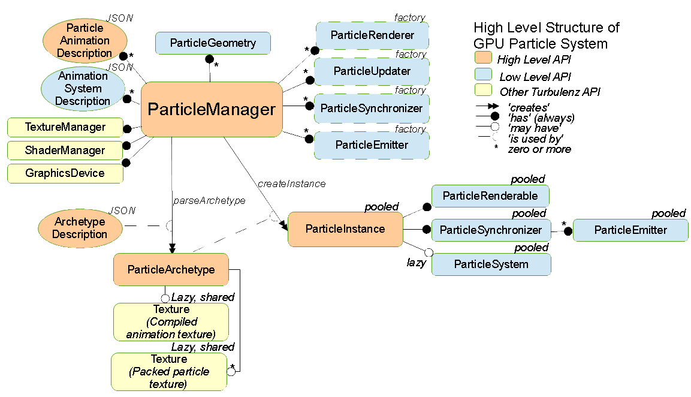

.. index::
    single: ParticleManager

.. highlight:: javascript

.. _particlemanager:

==========================
The ParticleManager Object
==========================

**Added SDK 0.28.0**

The ParticleManager is used to create and manage GPU based particle systems.

The ParticleManager is data-driven, with particle systems represented entirely by an easily serializable :ref:`ParticleArchetype <particlearchetype>` description.

.. WARNING::
    GPU Particle system depends on having access to at least 4 vertex texture units. This is not a required feature for WebGL conformance and must be checked for on the :ref:`GraphicsDevice <graphicsdevice>`. ::

        if (graphicsDevice.maxSupported("VERTEX_TEXTURE_UNITS") < 4)
        {
            // GPU Particle System cannot be used!
        }

    This diagram shows the structure of the High Level GPU Particle System and its components.

Methods
=======

.. index::
    pair: ParticleManager; create

`create`
--------

**Summary**

Create a new ParticleManager

**Syntax** ::

    var particleManager = ParticleManager.create(graphicsDevice, textureManager, shaderManager);

``graphicsDevice``
    The :ref:`GraphicsDevice <graphicsdevice>` object.

``textureManager``
    The :ref:`TextureManager <texturemanager>` object.

``shaderManager``
    The :ref:`ShaderManager <shadermanager>` object.

.. index::
    pair: ParticleManager; initialize

`initialize`
------------

**Summary**

Initialize the particle manager, this must be called before any particle systems are created using the particleManager.

**Syntax** ::

    particleManager.initialize(scene, passIndex);

``scene``
    The :ref:`Scene <scene>` object the manager will work with.

``passIndex``
    The passIndex for `transparent` renderables defined by the renderer in use.

    For example, if using the :ref:`DefaultRendering <defaultrendering>` object, this should be set to `renderer.passIndex.transparent`. The pass index is used to define the ordering of draw calls so that particle systems (as a generally transparent medium) will be rendered after normal geometry, and will be z-sorted along with other transparent geometry in the :ref:`Scene <scene>`.

.. index::
    pair: ParticleManager; registerParticleAnimation

`registerParticleAnimation`
---------------------------

**Summary**

Register a particle animation object to be referenced by particle systems created by the particle manager.

**Syntax** ::

    particleManager.registerParticleAnimation(definition);

``definition``
    The :ref:`particle animation definition <particleanimationdefinition>`.

    The name of the particle animation defined will be used to look up this definition when creating particle systems.

.. index::
    pair: ParticleManager; registerAnimationSystem

`registerAnimationSystem`
-------------------------

**Summary**

Register a particle animation system object to be referenced by particle systems created by the particle manager.

**Syntax** ::

    particleManager.registerAnimationSystem(name, definition);

``name``
    The name of the animation system defined will be used to look up this definition when creating particle systems.

``definition``
    The :ref:`particle animation system <particleanimationsystemdefinition>`.

.. index::
    pair: ParticleManager; registerGeometry

`registerGeometry`
------------------

**Summary**

Register a function to be used to create a :ref:`ParticleGeometry <particlegeometry>` object as required by the particle manager.

**Syntax** ::

    particleManager.registerGeometry(name, constructor)

``name``
    The name of the geometry to be referenced by renderers.

``constructor``
    Function to construct a shared geometry instance.

    Function takes as parameters the :ref:`GraphicsDevice <graphicsdevice>` and an initial particle capacity for the geometry to be created with.

.. index::
    pair: ParticleManager; registerRenderer

`registerRenderer`
------------------

**Summary**

Register the set of functions required to create and work with a :ref:`ParticleRenderer <particlerenderer>` in the particle manager.

**Syntax** ::

    particleManager.registerRenderer(name, parser, compressor, loader, constructor, geometry);

``name``
    The name of the renderer to be referenced by particle archetypes.

``parser``
    A function taking as arguments a :ref:`ParticleParticleBuildError <builderror>` object for reporting warnings and parse errors, and the compressed JSON object representing those values configurable for the renderer.

    This function should verify the input JSON object for correctness, reporting warnings and errors as necessary and return the complete set of configurable options (including defaults if necessary) to be applied to an instance of this renderer.

``compressor``
    A function taking as argument the complete set of configurable options for the renderer, and returning its minimal representation.

   The parser and compressor should be inverses of each-other.

``loader``
    A function taking as arguments the complete set of configurable options for the renderer instance, a function to be used for loading shaders (accepting the shader path as argument) and a function to be used for loading textures (accepting the texture path as argument).

    This function should invoke the provided loader functions for all shaders and textures required by the renderer, and for the specific input set of options. These functions will be processed asynchronously.

``constructor``
   A function to be called to construct an instance of this renderer. This function should take no arguments.

``geometry``
    The registered name of a :ref:`ParticleGeometry <particlegeometry>` compatible with this renderer.

.. index::
    pair: ParticleManager; registerUpdater

`registerUpdater`
------------------

**Summary**

Register the set of functions required to create and work with a :ref:`ParticleUpdater <particleupdater>` in the particle manager.

**Syntax** ::

    particleManager.registerUpdater(name, parser, compressor, loader, constructor);

``name``
    The name of the updater to be referenced by particle archetypes.

``parser``
    A function taking as arguments a :ref:`ParticleBuildError <builderror>` object for reporting warnings and parse errors, and the compressed JSON object representing those values configurable for the updater.

    This function should verify the input JSON object for correctness, reporting warnings and errors as necessary and return the complete set of configurable options (including defaults if necessary) to be applied to an instance of this updater.

``compressor``
    A function taking as argument the complete set of configurable options for the updater, and returning its minimal representation.

   The parser and compressor should be inverses of each-other.

``loader``
    A function taking as arguments the complete set of configurable options for the updater instance, a function to be used for loading shaders (accepting the shader path as argument) and a function to be used for loading textures (accepting the texture path as argument).

    This function should invoke the provided loader functions for all shaders and textures required by the updater, and for the specific input set of options. These functions will be processed asynchronously.

``constructor``
   A function to be called to construct an instance of this updater. This function should take no arguments.

.. index::
    pair: ParticleManager; registerSynchronizer

`registerSynchronizer`
----------------------

**Summary**

Register the set of functions required to create and work with a :ref:`ParticleSynchronizer <particlesynchronizer>` in the particle manager.

**Syntax** ::

    particleManager.registerSynchronizer(name, parser, compressor, constructor);

``name``
    The name of the synchronizerr to be referenced by particle archetypes.

``parser``
    A function taking as arguments a :ref:`ParticleBuildError <builderror>` object for reporting warnings and parse errors, and the compressed JSON object representing those values configurable for the synchronizer.

    This function should verify the input JSON object for correctness, reporting warnings and errors as necessary and return the complete set of configurable options (including defaults if necessary) to be applied to an instance of this synchronizer.

``compressor``
    A function taking as argument the complete set of configurable options for the synchronizer, and returning its minimal representation.

   The parser and compressor should be inverses of each-other.

``constructor``
   A function to be called to construct an instance of this synchronizer. This function should take no arguments.

.. index::
    pair: ParticleManager; registerEmitter

`registerEmitter`
----------------------

**Summary**

Register the set of functions required to create and work with a :ref:`ParticleEmitter <particleemitter>` in the particle manager.

**Syntax** ::

    particleManager.registerEmitter(name, parser, compressor, getBurstCount, getTotalLifeTime, constructor);

``name``
    The name of the emitter to be referenced by particle archetypes.

``parser``
    A function taking as arguments a :ref:`ParticleBuildError <builderror>` object for reporting warnings and parse errors, and the compressed JSON object representing those values configurable for the emitter. A final argument to this function is the name of all particles defined for the system archetype currently being parsed so that this function may verify emitters reference only particles defined for the system.

    This function should verify the input JSON object for correctness, reporting warnings and errors as necessary and return the complete set of configurable options (including defaults if necessary) to be applied to an instance of this emitter.

``compressor``
    A function taking as argument the complete set of configurable options for the emitter, and returning its minimal representation.

   The parser and compressor should be inverses of each-other.

``getBurstCount``
    Get burst count required for emitter so that it auto-disabled after the given period of time. Function takes the parsed archetype of emitter as argument, and the active time.

``getTotalLifeTime``
    Function returning total (upper bound) on emitter life time given a burst count (Time at which the last particle would in worst case be killed). Function takes as arguments the parsed system archetype, the specific parsed emitter archetype and the burst count.

``constructor``
   A function to be called to construct an instance of this emitter. This function should take no arguments.

.. index::
    pair: ParticleManager; computeAnimationLifeTime

`computeAnimationLifeTime`
--------------------------

**Summary**

Compute the amount of time covered by the given particle animation in seconds.

**Syntax** ::

    var lifeTime = particleManager.computeAnimationLifeTime(particleAnimationName);

.. index::
    pair: ParticleManager; loadArchetype

`loadArchetype`
---------------

**Summary**

Load all assets required by a particle system archetype.

This must be performed before creating a system from its archetype, and it is assumed that all required textures and shaders have completed their load before a system is created.

**Syntax** ::

    particleManager.loadArchetype(archetype, onload);

``archetype``
    The particle system archetype to be loaded.

``onload`` (Optional)
    A function to be called once the archetypes dependents have been loaded. This function should take the fully loaded archetype as argument.

.. index::
    pair: ParticleManager; destroyArchetype

`destroyArchetype`
------------------

**Summary**

Destroy all instances of an archetype, and any other generated data such as run-time packed textures and object pools. This has the effect of completely resetting the state of an archetype, so that when used to again create instances it will be as though it was never used in the past. This should be used to clean up an archetype that will no longer be used.

Note that this does not actually `destroy` the archetype, the archetype itself may be used again.

**Syntax** ::

    particleManager.destroyArchetype(archetype);

.. index::
    pair: ParticleManager; replaceArchetype

`replaceArchetype`
------------------

**Summary**

Re-build any existing particle instances making use of the provided archetype, with the new provided archetype. This feature is not expected to be performant, but is invaluable in performing live-updates of particle systems in a world for purposes of in-game editors.

As some properties, such as particle system extents and particle capacities are immutable, this is the only way of easily effecting such changes for current systems in use.

Existing references to particle instances will remain valid, with the existing particle instance objects re-used for the replaced systems.

Emitters of the new instance will all be enabled, this is not intended for use with short-lived effects that are already created.

**Syntax** ::

    particleManager.replaceArchetype(oldArchetype, newArchetype);

``oldArchetype``
    The old particle archetype. All instances of this archetype will be modified in-place to make use of the new archetype.

    The old archetype will remain valid for further use if necessary.

``newArchetype``
    The new, pre-loaded particle archetype to use as replacement.

.. index::
    pair: ParticleManager; createInstance

`createInstance`
----------------

**Summary**

Create a :ref:`ParticleInstance <particleinstance>` of a particle system from its archetype.

It is assumed that this archetype has had all its required textures and shaders pre-loaded.

The emitters of the system will be enabled automatically. If a timeout is specified, then the emitters will have its `timeout` function called to enable the emitter as long as is necessary to have the effect come to a natural end when the instance is removed.

**Syntax** ::

    var instance = particleManager.createInstance(archetype, timeout, baseTechniqueParametersList);

``archetype``
    The pre-loaded archetype to create instance from.

``timeout`` (Optional)
    The amount of time this instance should exist for. Once this amount of time has passed, the instance will be automatically removed from the scene if necessary, and recycled.

    This parameter should be specified for the creation of short-lived effects, the manager makes use of an internal optimized data structure for handling large numbers of short-lived effects in conjunction with the updates of the particleManager.

``baseTechniqueParametersList`` (Optional)
    A list of :ref:`TechniqueParameters <techniqueparameters>` to be applied to the instances :ref:`ParticleRenderable <particlerenderable>` before system specific parameters are set during rendering of the particle system.

.. index::
    pair: ParticleManager; createTimedInstance

`createTimedInstance`
---------------------

**Summary**

Helper function. Will set up a particle instance whose emitters remain active for the given period of time (by suitable calls to `emitter.burst(N)`) and whose timeout is sufficiently large that all particles fade out naturally before the instance is removed.

**Syntax** ::

    var instance = particleManager.createTimedInstance(archetype, activeTime, baseTechniqueParametersList);

``archetype``
    The pre-loaded archetype to create instance from.

``activeTime``
    All emitters will be disabled after this amount of time has passed.

``baseTechniqueParametersList`` (Optional)
    A list of :ref:`TechniqueParameters <techniqueparameters>` to be applied to the instances :ref:`ParticleRenderable <particlerenderable>` before system specific parameters are set during rendering of the particle system.

.. index::
    pair: ParticleManager; createBurstInstance

`createBurstInstance`
---------------------

**Summary**

Helper function. Will set up a particle instance whose emitters are set to burst exactly the given number of times, and whose timeout is sufficiently large that all particles fade out naturally before the instance is removed.

**Syntax** ::

    var instance = particleManager.createBurstInstance(archetype, burstCount, baseTechniqueParametersList);

``archetype``
    The pre-loaded archetype to create instance from.

``burstCount`` (Optional)
    The number of times each emitter should burst.

    If unspecified, a default value of `1` is assumed to perform a single burst of the system.

``baseTechniqueParametersList`` (Optional)
    A list of :ref:`TechniqueParameters <techniqueparameters>` to be applied to the instances :ref:`ParticleRenderable <particlerenderable>` before system specific parameters are set during rendering of the particle system.

.. index::
    pair: ParticleManager; createMultiBurstInstance

`createMultiBurstInstance`
--------------------------

**Summary**

Helper function. Will set up a particle instance whose emitters are set to burst exactly the given number of times, and whose timeout is sufficiently large that all particles fade out naturally before the instance is removed. Each emitter may be provided with a different number of bursts compared to the `createBurstInstance` helper.

**Syntax** ::

    var instance = particleManager.createMultiBurstInstance(archetype, burstCounts, baseTechniqueParametersList);

``archetype``
    The pre-loaded archetype to create instance from.

``burstCounts``
    An array containing the number of times each emitter should burst.

``baseTechniqueParametersList`` (Optional)
    A list of :ref:`TechniqueParameters <techniqueparameters>` to be applied to the instances :ref:`ParticleRenderable <particlerenderable>` before system specific parameters are set during rendering of the particle system.

.. index::
    pair: ParticleManager; createConjoinedInstance

`createChildInstance`
---------------------

**Summary**

Create a :ref:`ParticleInstance <particleinstance>` referencing another instance without its own particle system.

The created instance will never hold its own particle system, and will instead provide an additional rendering of
the provided instance's system instead.

This may be used to render a particle system in many places around a scene, without having many real particle systems
providing a big performance benefit if suitable.

Any child instance will be automatically destroyed if the original root instance is destroyed.

.. note :: The usual behaviour regarding fade-in/fade-out of particle instance will not occur for child instances, they are purely an additional render of an existing instance.

**Syntax** ::

    var instance = particleManager.createChildInstance(instance, timeout, baseTechniqueParametersList);

``instance``
    The instance from which to create the child instance.

``timeout`` (Optional)
    The amount of time this instance should exist for. Once this amount of time has passed, the instance will be automatically removed from the scene if necessary, and recycled.

    Unlike with true instances, the child instance will not generally have its effect faded out when the instance dies as it has no control over the underlying particle system.

    If unspecified, the parent instance's timeout will be inherited.

``baseTechniqueParametersList`` (Optional)
    A list of :ref:`TechniqueParameters <techniqueparameters>` to be applied to the instances :ref:`ParticleRenderable <particlerenderable>` before system specific parameters are set during rendering of the particle system.

.. index::
    pair: ParticleManager; destroyInstance

`destroyInstance`
-----------------

**Summary**

Destroy a :ref:`ParticleInstance <particleinstance>`, removing it from the scene and releasing it for re-use by another instantiation of the same archetype.

**Syntax** ::

    particleManager.destroyInstance(instance);

.. index::
    pair: ParticleManager; clear

`clear`
-------

**Summary**

Destroy every instance associated with the particle particleManager.

**Syntax** ::

    particleManager.clear(archetype);

``archetype`` (Optional)
    If an archetype is specified, only instances of that archetype will be destroyed. This is not the same as `destroyArchetype`, as other generated state such as run-time packed textures and object pools will remain intact. If you are not intending on ever using this archetype again, you should use `destroyArchetype` instead.

.. index::
    pair: ParticleManager; destroy

`destroy`
---------

**Summary**

Destroy the particle particleManager. This will destroy all state associated with every archetype used with this manager including all existing particle instances, and will also destroy shared texture and render target states, and release any other allocated GPU memory, ensuring all memory allocated on the CPU is released for garbage collection.

The manager nor any particle instance created with it may be used after this call.

**Syntax** ::

    particleManager.destroy();

.. index::
    pair: ParticleManager; update

`update`
--------

**Summary**

Update the particle particleManager.

This call will update the internal clock of the manager used by all created particle systems to track the passage of time, and will also be used to cull short-lived instances created in the manager automatically when required even if they are off-screen (or never made visible at all).

**Syntax** ::

    particleManager.update(timeStep);

``timeStep``
    The amount of elapsed time to be added to the managers timer in seconds.

    There is no need to tie this update to a fixed time-step, as this will have no effect on how the systems are updated when rendered. Any fixed time-step simulation of systems is the responsibility of individual system synchronizers.

.. index::
    pair: ParticleManager; addInstanceToScene

`addInstanceToScene`
--------------------

**Summary**

Add the provided :ref:`ParticleInstance <particleinstance>` as a child of the given scene node to the scene.

**Syntax** ::

    particleManager.addInstanceToScene(instance, parent);

``instance``
    The particle system instance created by the manager to be added to the scene.

``parent`` (Optional)
    The parent :ref:`SceneNode <scenenode>` to add this system instance as a child of. If omitted, the system will be added as a root node of the scene.

.. index::
    pair: ParticleManager; removeInstanceFromScene

`removeInstanceFromScene`
-------------------------

**Summary**

Remove the provided :ref:`ParticleInstance <particleinstance>` from the scene.

**Syntax** ::

    particleManager.removeInstanceFromScene(instance);

``instance``
    The particle system instance created by the manager to be removed from the scene.

.. index::
    pair: ParticleManager; compressArchetype

`compressArchetype`
-------------------

**Summary**

Compress the provided archetype, returning a minimal description from which the archetype can be recovered.

This can be used to save space when saving or transferring archetypes, and will be used when serializing an archetype.

**Syntax** ::

    var description = particleManager.compressArchetype(archetype);

``archetype``
    The particle system archetype to be compressed.

    The original archetype will be left intact.

.. index::
    pair: ParticleManager; decompressArchetype

`parseArchetype`
---------------------

**Summary**

Parse a given archetype into a fully prepared object for use in manager, this allows an archetype to be specified with only those fields that are not equal to the defaults.

If parsing fails for whatever reason, then an exception will be thrown containing all reported warnings and errors for parsing stages.

To disable fail on warnings, set `failOnWarnings` to `false` on the particle manager.

**Syntax** ::

    var archetype = particleManager.parseArchetype(description);

``description``
    The archetype description to be parsed.

    The description will be left intact, and may - if ever required - be re-used.

.. index::
    pair: ParticleManager; serializeArchetype

`serializeArchetype`
--------------------

**Summary**

Serialize the provided archetype to a JSON string, this method will first compress the archetype to its minimal description.

This method can be used as a cost-efficient way of saving archetypes to file.

**Syntax** ::

    var serializedString = particleManager.serializeArchetype(archetype);

``archetype``
    The archetype to be serialized.

    The archetype will be left intact for continued use.

.. index::
    pair: ParticleManager; deserializeArchetype

`deserializeArchetype`
----------------------

**Summary**

Deserializes an archetype from its compressed JSON representation, this method will parse the archetype description into a fully prepared archetype object for use in the particleManager.

**Syntax** ::

    var archetype = particleManager.deserializeArchetype(jsonString);

``jsonString``
    The serialized representation of an archetype.

.. index::
    pair: ParticleManager; gatherMetrics

`gatherMetrics`
---------------

**Summary**

Gather metrics regarding the state of the particle manager and its memory usage.

**Syntax** ::

    var metrics = particleManager.gatherMetrics(archetype);

``archetype`` (Optional)
    If an archetype is provided, then only metrics regarding instances of that particular archetype will be gathered.

The return object has fields:

`(If no archetype was provided)`
 * numInitializedArchetypes
 * numPooledViews
 * numPooledSynchronizers
 * numPooledEmitters

`(Always present on object)`
 * numPooledSystems
 * numPooledInstances
 * numActiveInstances: `number of ParticleInstances that are actively being updated and rendered (Are currently visible).`
 * numAllocatedInstances: `number of ParticleInstances that have had systems and views allocated, and occupy space on the CPU and GPU (Have been visible at least once).`
 * numInstances: `number of ParticleInstances that are alive as part of the Scene.`

The total number of `ParticleInstances` created is the sum of `numInstances` and `numPooledInstances`. The `numAllocatedInstances` is always less than or equal to `numInstances`, and `numActiveInstances` is always less than or equal to `numAllocatedInstances`.

.. index::
    pair: ParticleManager; gatherInstanceMetrics

`gatherInstanceMetrics`
-----------------------

**Summary**

Gather metrics about individual :ref:`ParticleInstances <particleinstance>`.

**Syntax** ::

    var metrics = particleManager.gatherInstanceMetrics(archetype);

``archetype`` (Optional)
    If an archetype is provided, then only instances of that archetype will be gathered by this call.

The return value is an array of objects having the following fields:

``instance``
    The :ref:`ParticleInstance <particleinstance>` this metric object relates to.

``allocated``
    Whether this instance has been allocated a particle system and views, and occupies space on the CPU and GPU beyond its emitters and synchronizer.

``active``
    Whether this instance is actively being updated and rendered.

If an instance is `active`, then it is also `allocated`.

.. index::
    single: ParticleInstance

.. _particleinstance:

===========================
The ParticleInstance Object
===========================

The ParticleInstance object will be created by the :ref:`ParticleManager <particlemanager>` encapsulating the state of a current system.

Properties
==========

.. index::
    pair: ParticleInstance; renderable

`renderable`
------------

**Summary**

The :ref:`ParticleRenderable <particlerenderable>` created for this instance. This property will always be defined, and may be used to move/translate/scale the particle system using the renderable's local-transform.

This renderable should not be added or removed from a :ref:`Scene <scene>` manually. Instead the `addInstanceToScene` and `removeInstanceFromScene` methods of the :ref:`ParticleManager <particlemanager>` should be used.

.. note :: Read Only

.. index::
    pair: ParticleInstance; synchronizer

`synchronizer`
--------------

**Summary**

The :ref:`ParticleSynchronizer <particlesynchronizer>` created for this instance. This property will always be defined, and may be used to add and remove emitters at run-time for a particular instance.

.. note :: Read Only

.. index::
    pair: ParticleInstance; system

`system`
--------

**Summary**

The :ref:`ParticleSystem <particlesystem>` created for this instance.

This system will be lazily allocated when the instance has first become visible, and may never exist at all.

.. note :: Read Only

.. index::
    pair: ParticleInstance; timeout

`timeout`
---------

**Summary**

The timeout value used when instance was created.

.. note :: Read Only
