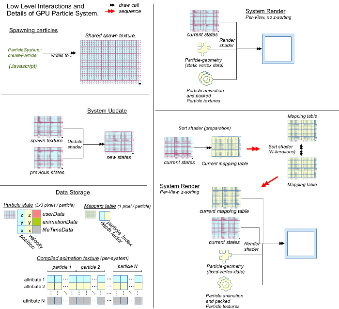

.. index::
    single: ParticleSystem

.. highlight:: javascript

.. _particlesystem:

=========================
The ParticleSystem Object
=========================

Added 2013-12-12 First BETA release (Open Source Only).

The ParticleSystem object encapsulates the core of a particle system, though most of its functionality is plug-in. It is responsible for enabling emitters to create particles, and to be able to update particle states, sort views and render views of a system. The ParticleSystem object is also responsible for CPU-side simulation of particles for tracked GPU particles, and path prediction for emitters.

.. note::
    This is a low-level particle system API.

.. figure:: img/Low-Level.png

Methods
=======

.. index::
    pair: ParticleSystem; getDefaultNoiseTexture

`getDefaultNoiseTexture`
------------------------

**Summary**

A default 1x1 procedural noise texture for updaters and renderers, with all channels set to the normalized, signed float representation of `0` specifying no noise is to be applied.

**Syntax** ::

    var texture = ParticleSystem.getDefaultNoiseTexture(graphicsDevice);

``graphicsDevice``
    The :ref:`GraphicsDevice <graphicsdevice>` object.

.. index::
    pair: ParticleSystem; create

`create`
--------

**Summary**

Create a new particle system.

**Syntax** ::

    var system = ParticleSystem.create({
        graphicsDevice      : graphicsDevice,
        center              : [0, 0, 0],
        halfExtents         : [1, 1, 1],
        maxSpeed            : 10,
        maxParticles        : 1024,
        zSorted             : true,
        maxSortSteps        : null,
        maxLifeTime         : 10,
        animation           : animationTexture,
        sharedAnimation     : false,
        trackingEnabled     : false,
        timer               : null,
        synchronizer        : systemSynchronizer,
        updater             : systemUpdater,
        renderer            : systemRenderer,
        shaderManager       : shaderManager,
        geometry            : particleGeometry,
        sharedRenderContext : null
    });

``graphicsDevice``
    :ref:`GraphicsDevice <graphicsdevice>` object.

``center`` (Optional)
    Default value `[0, 0, 0]`. The center of the local particle extents.

``halfExtents``
    The local half-extents of the particle system. Together with `center` this defines a region of spcae in local coordinates which absolutely contains the particle system. Particles will not be able to escape the extents, and the extents will be used for :ref:`ParticleRenderables <particlerenderable>` for :ref:`Scene <scene>` culling.

``maxSpeed```
    The maximum speed achievable for particles in the system, required to normalize velocities.

``maxParticles``
    The maximum amount of particles that can exist in the system. This value is limited to `65536` for any particle system so that higher data compression can be achieved both CPU, and GPU side.

``zSorted`` (Optional)
    Default value `false`. If true, then views onto this system will be z-sorted. The cost of sorting a view of a system is difficult to reason about as it is performed on the GPU, but we can directly reason about the number of draw calls required to sort which scales according to `log2(n)^2` for `n` particles.

``maxSortSteps`` (Optional)
    The specific sorting algorithm used permits partial sorts of a view onto the system so that you may spread the cost of sorting over a period of time for better performance. The actual number of steps used depends on maxParticles, but this will place an upper bound on that number. By default a view will be completely sorted at every rendering.

``maxLifeTime``
    The maximum life permissable for any particle in the system, it will not be possible to created a particle whose life-time is greater than this value.

``animation`` (Optional)
    The animation :ref:`Texture <texture>` created by the :ref:`ParticleBuilder <particlebuilder>` object representing the animations of all particles to be created in this system, used by a compatible rendering shader.

``sharedAnimation`` (Optional)
    Default value is `false`. If `false`, then when the system is destroyed, the `animation` texture supplied to the system will also be destroyed.

``trackingEnabled`` (Optional)
    Default value is `false`. If `true`, then created particles will be able to be simulated on the CPU as well as the GPU, so that positions, velocities and other attributes may be queried at any future time until death to permit emitting particles based on positions of existing particles. This will essentially double the cost of simulating any tracked particles.

``timer`` (Optional)
    Specify a timer function to determine the passage of time seen by the particle system on update. By default a function will be used which returns `TurbulenzEngine.time`, you would most certainly want this to be tied to a game update tick instead.

``synchronizer`` (Optional)
    A :ref:`ParticleSynchronizer <particlesynchronizer>` object, to update the system and emit particles when the system is updated via a :ref:`ParticleRenderable <particlerenderable>`.

    If unspecified, a :ref:`DefaultParticleSynchronizer <defaultparticlesynchronizer>` will be used.

``updater`` (Optional)
    The :ref:`ParticleUpdater <particleupdater>` object for the particle system, responsible for defining the techniques and parameters used for GPU side simulation of particles, a function used to work on simulation of CPU side particles, and a prediction function to support retrospective creation of particles by emitters.

    If unspecified, a shared :ref:`DefaultParticleUpdater <defaultparticleupdater>` will be used.

``renderer`` (Optional)
    The :ref:`ParticleRenderer <particlerenderer>` object for the particle system, responsible for rendering particles on the GPU.

    If unspecified, a shared :ref:`DefaultParticleRenderer <defaultparticlerenderer>` will be used using the `alpha` blend mode.

``shaderManager`` (Optional)
    A :ref:`ShaderManager <shadermanager>` object used to construct the default updater or renderer when un-specified. If specifying both a renderer and updater, then the shader manager is not required.

``geometry`` (Optional)
    The :ref:`ParticleGeometry <particlegeometry>` instance to use in rendering a view of the system. This geometry instance must be at least as large as to render `maxParticles` number of particles.
    If the geometry instance is not marked as `shared`, then it will be destroyed along with the system.
    If geometry is not specified, an un-shared geometry will be created from the provided `renderer`.

``sharedRenderContext`` (Optional)
    A :ref:`SharedRenderContext <sharedrendercontext>` object from which to allocate texture regions for particle states on the GPU.

    If unspecified then a per-system set of textures and render targets will be created isntead and destroyed along with the system. Otherwise on destruction of the system the allocated region will be released back to the shared render context.



.. index::
    pair: ParticleSystem; destroy

`destroy`
---------

**Summary**

Destroy particle system. The system cannot be used once it has been destroyed. This will release memory used for particle state textures, as well as any non-shared geometry and animation textures.

**Syntax** ::

    system.destroy();

.. index::
    pair: ParticleSystem; reset

`reset`
-------

**Summary**

Reset a particle system to initial state.

All particles will be removed from the system, with internal timers reset so that particle system can be recycled.

**Syntax** ::

    system.reset();

.. _particlesystem_createparticle:

.. index::
    pair: ParticleSystem; createParticle

`createParticle`
----------------

**Summary**

Create a new particle in the system.

Note that this particle will be created at the end of the current update, and so will not take part in the simulation until the following update occurs.

.. note :: This method should only be called between `beginUpdate` and `endUpdate`

**Syntax** ::

    var id = system.createParticle({
       position: [0, 0, 0],
       velocity: [0, 1, 0],
       lifeTime: 1.5,
       animationRange: [0, 1],
       userData: 0,
       forceCreation: false,
       isTracked: false
    });

``position``
    A :ref:`Vector3 <v3object>` for the position to create particle at in local coordinates, this will be clamped to the particles extents due to normalization.

``velocity``
    A :ref:`Vector3 <v3object>` for the velocity of the created particle in local coordinates, this will clamped to the particles extents size due to normalization.

``lifeTime``
    The amount of time in seconds that this particle will live for. This will clamped to the defined `maxLifeTime` of the system due to normalization.

``animationRange``
    The normalized column coordinates defining the subset of the systems `animation` texture to be used for this particle.

``userData`` (Optional)
    The 32-bit signed integer to use for this particles `userData` field. Default `0`.

``forceCreation`` (Optional)
    Defalut value is `false`. If `true`, then this particle will be created, even when there is no space remaining in the system. Under such circumstances, the live particle closest to death will be replaced by the newly created particle.

    Note that tracked particles are excluded from such replacement, so that even with `forceCreation` as `true`, in the rare event that the system is saturated with tracked particles, the creation will still fail.

``isTracked`` (Optional)
    Default value is `false`. If `true`, and `trackingEnabled` is `true` on the system, this particle will also be simulated on the CPU so that its position, velocity and other attributes can be queried throughout its life, and partial updates of the particles attributes may be made.

The return value is the integer `id` corresponding to the particle slot used to create this particle. If the particle could not be created, then this `id` will be equal to `null`. If the particle is tracked, then this `id` can be used to query the particles attributes throughout its life.

If the particle was not able to be created, then it is guaranteed that no further attempt to create a particle without `forceCreation` set to `true` will succeed until a system update has been perfomed.

    Note that tracked particles will `not` be killed when their life is exhausted, and must be removed manually. This is to enable particle attributes to be queried even after death to determine final position/velocities.

.. index::
    ParticleSystem; updateParticle

`updateParticle`
----------------

**Summary**

Update the state of a cpu-tracked particle in the system. It is up to you to know whether a particle has died and been replaced. Updating the state of a particle that has died will have no effect (it will remain dead), however updating the state of a particle that has died, and been 'replaced' will cause the replaced particle to have it's state updated instead.

.. note :: This method should only be called between `beginUpdate` and `endUpdate`

**Syntax** ::

    system.updateParticle(particleID, {
       position: [0, 0, 0],
       velocity: [0, 1, 0],
       animationRange: [0, 1],
       userData: 0,
       isTracked: false
    });

``particleID``
    The id of the tracked particle to be updated.

``position`` (Optional)
    A :ref:`Vector3 <v3object>` for the new position of the particle in local coordinates, this will be clamped to the particles extents due to normalization. If left unspecified, position will not be changed.

``velocity`` (Optional)
    A :ref:`Vector3 <v3object>` for new velocity of the created particle in local coordinates, this will clamped to the particles extents size due to normalization. If left unspecified, velocity will not be changed.

``animationRange`` (Optional)
    The normalized column coordinates defining the subset of the systems `animation` texture to be used for this particle. If left unspecified, this will not be changed.

``userData`` (Optional)
    The 32-bit signed integer to use for this particles `userData` field. If left unspecified, userData will not be changed.

``isTracked`` (Optional)
    Setting to `false` will specify that you no longer wish this particle to be tracked on the CPU. Once un-tracked you cannot safely update its state, unless specifying all fields, though you still may as usual remove it from the system. If left unspecified, the tracked nature of the particle will not be changed.

.. index::
    ParticleSystem; removeParticle

`removeParticle`
----------------

**Summary**

Remove a particle from the system by force. This may be called for any particle, whether tracked or not, but it is up to you to ensure the particle id used refers to the particle you want. If the particle you are removing has already died and been replaced, then this call will remove the replaced particle.

.. note :: This method should only be called between `beginUpdate` and `endUpdate`

**Syntax** ::

    system.removeParticle(particleID);

``particleID``
    The id of the tracked particle to be updated.

.. index::
    ParticleSystem; removeAllParticles

`removeAllParticles`
--------------------

**Summary**

Remove all particles from the system by force.

.. note :: This method should only be called between `beginUpdate` and `endUpdate`

**Syntax** ::

    system.removeAllParticles();

.. index::
    ParticleSystem; sync

`sync`
------

**Summary**

Synchronise the system. This method is called by any :ref:`ParticleRenderable <particlerenderable>` visible in a :ref:`Scene <scene>` making use of this system, and may also be called manually if required.

This method will invoke the systems synchronizer method, providing it with the frame and time delta (as determined by the system's `timer`).

.. note :: Method will fail if a synchronizer object was not provided to the system.

**Syntax** ::

    system.sync(currentFrameIndex);

``currentFrameIndex``
    The index of the current frame being rendered, this is used to determine if the system has already been updated for the current rendering frame regardless of timer return values.

.. index::
    ParticleSystem; prune

`beginUpdate`
-------------

**Summary**

Begin an update on the system. At this point particles which would be killed by the update are pre-emptively made available for re-use so that creation of new particles may take their place.

.. note :: Only a single particle system may be updated at any time.

**Syntax** ::

    system.beginUpdate(deltaTime, shift);

``deltaTime``
    The amount of time in seconds that will be simulated for this update.

``shift`` (Optional)
    A :ref:`Vector3 <v3object>` object specifying a local displacement to apply to all existing particles in the system to enable trails to form for moving systems. Default value is `[0, 0, 0]`.

.. index::
    ParticleSystem; step

`endUpdate`
-----------

**Summary**

Complete an update on a system, at this point the system will be updated including adding newly created particles into the system. This call will return `true` if there is any possibility of a live particle remaining in the system indicating that a render is required for any view onto the system.

**Syntax** ::

    var shouldRender = system.endUpdate(deltaTime);

.. index::
    ParticleSystem; queryPosition

`queryPosition`
---------------

**Summary**

Query the position of a CPU-tracked particle.

**Syntax** ::

    var position = system.queryPosition(particleID);
    // or
    system.queryPosition(particleID, position);

``particleID``
    The id of the cpu-tracked particle.

``position`` (Optional)
    If specified, the position will be written to this :ref:`Vector3 <v3object>` and returned, otherwise a new :ref:`Vector3 <v3object>` will be allocated.

.. index::
    ParticleSystem; queryVelocity

`queryVelocity`
---------------

**Summary**

Query the velocity of a CPU-tracked particle.

**Syntax** ::

    var velocity = system.queryVelocity(particleID);
    // or
    system.queryVelocity(particleID, velocity);

``particleID``
    The id of the cpu-tracked particle.

``velocity`` (Optional)
    If specified, the velocity will be written to this :ref:`Vector3 <v3object>` and returned, otherwise a new :ref:`Vector3 <v3object>` will be allocated.

.. index::
    ParticleSystem; queryRemainingLife

`queryRemainingLife`
--------------------

**Summary**

Query the remaining life of a CPU-tracked particle.

**Syntax** ::

    var remainingLife = system.queryRemainingLife(particleID);

``particleID``
    The id of the cpu-tracked particle.


Properties
==========

.. index::
    pair: ParticleSystem; center

`center`
--------

**Summary**

The center of the particle systems extents in local coordinates.

.. note :: Read Only

.. index::
    pair: ParticleSystem; halfExtents

`halfExtents`
-------------

**Summary**

The half-extents of the particle system in local coordinates.

.. note :: Read Only

.. index::
    pair: ParticleSystem; maxParticles

`maxParticles`
--------------

**Summary**

The maximum amount of particles the system can hold.

.. note :: Read Only

.. index::
    pair: ParticleSystem; maxSpeed

`maxSpeed`
----------

**Summary**

The maximum speed achievable for any particle in the system.

.. note :: Read Only

.. index::
    pair: ParticleSystem; zSorted

`zSorted`
---------

**Summary**

Whether views onto this system will be z-sorted.

.. note :: Read Only

.. index::
    pair: ParticleSystem; updater

`updater`
---------

**Summary**

The :ref:`ParticleUpdater <particleupdater>` object assigned to this system. Note that modifying the `parameters` field of this object will have no effect on any system already using the updater.

.. note :: Read Only

.. index::
    pair: ParticleSystem; renderer

`renderer`
----------

**Summary**

The :ref:`ParticleUpdater <particleupdater>` object assigned to this system. Note that modifying the `parameters` field of this object will have no effect on any system already using the renderer.

.. note :: Read Only

.. index::
    pair: ParticleSystem; synchronizer

`synchronizer`
--------------

**Summary**

The synchronizer object assigned to this system.

.. note :: Read Only

.. index::
    pair: ParticleSystem; updateParameters

`updateParameters`
------------------

**Summary**

The :ref:`TechniqueParameters <techniqueparameters>` object encapsulating all parameters defined for the specific updater, and by the system for updating the particle system. You may use this object to change the specific updater parameters exposed, but you should not make changes to those defined by the `ParticleSystem` itself.

.. index::
    pair: ParticleSystem; renderParameters

`renderParameters`
------------------

**Summary**

The :ref:`TechniqueParameters <techniqueparameters>` object encapsulating all parameters defined for the specific renderer, and by the system for updating the particle system. You may use this object to change the specific renderer parameters exposed, but you should not make changes to those defined by the `ParticleSystem` itself.

.. index::
    pair: ParticleSystem; PARTICLE_

`PARTICLE_`
-----------

**Summary**

Integer constants defining storage information for particles on the CPU and GPU.

* `PARTICLE_DIMX` Width of individual particle state on GPU in pixels.
* `PARTICLE_DIMY` Height of individual particle state on GPU in pixels.
* `PARTICLE_SPAN` Span of an individual particle state on CPU in data store.
* `PARTICLE_POS` Offset from start of an individual particle state on CPU to its position vector (stored as 3 successive values).
* `PARTICLE_VEL` Offset from start of an individual particle state on CPU to its velocity vector (stored as 3 successive values)
* `PARTICLE_LIFE` Offset from start of an individual particle state on CPU to its life data.
* `PARTICLE_ANIM` Offset from start of an individual particle state on CPU to its animation range data.
* `PARTICLE_DATA` Offset from start of an individual particle state on CPU to its user data field.

**Syntax** ::

    var attr = ParticleSystem.PARTICLE_X;

