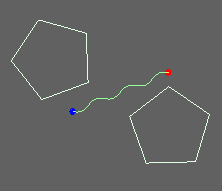
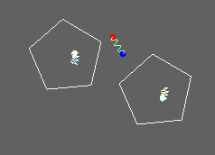
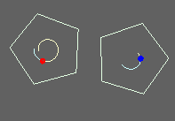
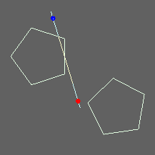
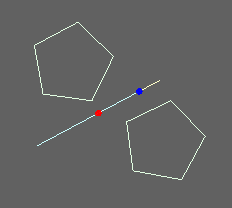
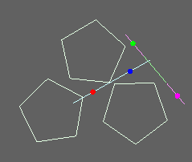

.. index:
    single: Physics2DDevice

.. highlight:: javascript

.. _physics2ddevice:

==========================
The Physics2DDevice Object
==========================

Provides rigid body physics, optimized for Javascript.

The Physics2DDevice object can be used to create the following objects:

* Rigid bodies: dynamic, static or kinematic.
* Shapes: polygon, circle.
* Vertex factories: rectangle, aligned box, regular polygon.
* Constraints: point to point, distance, weld, angle, motor, line, pulley, user constraint.
* World.
* Broadphases: 1-axis sweep and prune, box tree broadphase.
* CollisionUtils.
* Debug Draw.

Physics2D uses SI units of meters (`m`), radians (`rad`), seconds (`s`), kilograms (`kg`) and Newtons (`N`). Physics2D coordinates have y-axis pointing down.

Physics parameters are tuned for objects in size ranging down to an absolute minimum of `0.001m = 1mm`. Objects smaller than this will not behave correctly due to contact slop and thresholds in continuous collision detection routines. At the same time, for stability reasons there is a permitted slop in positional contacts of `0.01m = 1cm` so that whilst objects down to `1mm` are acceptible, objects this small will not interact together properly. You should try to keep objects at least `1cm` big.

A suggestion if your game operates in pixels (`px`) is to use a scaling factor of roughly `60px` for every `1m`.

**Required scripts**

The Physics2DDevice object requires::

    /*{{ javascript("jslib/physics2ddevice.js") }}*/
    /*{{ javascript("jslib/boxtree.js") }}*/

Methods
=======

.. _physics2ddevice_createworld:
.. index::
    pair: Physics2DDevice; createWorld

`createWorld`
-------------

**Summary**

Create a :ref:`World <physics2d_world>` object to which rigid bodies and constraints can be added.
Rigid bodies and constants can only be added to a single World at any given time.

**Syntax** ::

    var world = phys2D.createWorld({
        broadphase : broadphaseObject,
        gravity : [0, 10],
        velocityIterations : 8,
        positionIterations : 8,
    });

``broadphase`` (Optional)
    Supply a :ref:`Broadphase <broadphase>` object to be used by this World.

    If unspecified, then a :ref:`BoxTree <boxtree>` broadphase as created using `phys2D.createBoxTreeBroadphase()` will be used.

``gravity`` (Optional)
    The direction and magnitude of global acceleration due to `gravity`,
    applied to all dynamic bodies per update.

    Defaults to [0, 10].

``velocityIterations`` (Optional)
    The number of physics iterations to use when solving errors in velocity
    constraints. This value must be positive, and is largely responsible for
    the stability of the physics.

    Defaults to 8.

``positionIterations`` (Optional)
    The number of physics iterations to use when solving errors in position
    constraints. This value must be positive and is responsible for solving
    errors in contact penetrations and stiff constraints.

    Defaults to 8.

.. _physics2ddevice_sap:
.. index::
    pair: Physics2DDevice; createSweepAndPruneBroadphase

`createSweepAndPruneBroadphase`
-------------------------------

**Summary**

Create a :ref:`Broadphase <broadphase>` object built using a 1-axis Sweep and Prune approach in the x-axis direction.

**Syntax** ::

    var broadphase = phys2D.createSweepAndPruneBroadphase();

.. _physics2ddevice_boxtree:
.. index::
    pair: Physics2DDevice; createSweepAndPruneBroadphase

`createBoxTreeBroadphase`
-------------------------

**Summary**

Create a :ref:`Broadphase <broadphase>` object built using a pair of :ref:`BoxTree <boxtree>` objects separating static/sleeping
bodies from active bodies. This is a more generally performant broadphase than the 1-axis Sweep and Prune.

**Syntax** ::

    var broadphase = phys2D.createBoxTreeBroadphase();

.. _physics2ddevice_createbody:
.. index::
    pair: Physics2DDevice; createRigidBody

`createRigidBody`
-----------------

**Summary**

Create a :ref:`RigidBody <physics2d_body>` object.

**Syntax** ::

    phys2D.createRigidBody({
        type : 'dynamic',
        shapes : [],
        mass : 10,
        inertia : 20,
        sleeping : false,
        bullet : false,
        position : [0, 0],
        rotation : 0,
        velocity : [0, 0],
        angularVelocity : 0,
        force : [0, 0],
        torque : 0,
        linearDrag : 0.05,
        angularDrag : 0.05,
        surfaceVelocity : [0, 0],
        userData : null
    });

``type`` (Optional)
    The type of Rigid Body to create. One of `'static', 'dynamic', 'kinematic'`.

    Defaults to `'dynamic'`.

``shapes`` (Optional)
    The set of Shapes to assign to the Rigid Body. Shapes may not be shared between rigid bodies. Shapes of a `static` body may not be modified once the body has been assigned to a World object.

``mass`` (Optional)
    The mass in `kg` for this rigid body. This value must be strictly positive and has no effect on `static` and `kinematic` bodies which in terms of physics computations are assumed to have infinite mass. However if such a body should be transformed into a `dynamic` body at run-time, this value will still persist.

    If unspecified, mass will be computed as per `body.computeMassFromShapes()`.

``inertia`` (Optional)
    The moment of inertia in `kg.m`\ :sup:`2`\ `/rad`\ :sup:`2`\ . This value must be strictly positive and has no effect on `static` and `kinematic` bodies which in terms of physics computations are assumed to have infinite inertia. However if such a body should be transformed into a `dynamic` body at run-time, this value will still persist.

    If unspecified, inertia will be computed as per `body.computeInertiaFromShapes()`.

``sleeping`` (Optional)
    Define if the body is to be created in a sleeping state. When added to a :ref:`World <physics2d_world>` object, the body will remain asleep until woken.

    Defaults to `false`.

``bullet`` (Optional)
    Define if a `dynamic` body should collide continuously with other `dynamic` bodies. Continuous collision occur always between static/kinematic and dynamic bodies, but will occur between two dynamic bodies only if at least one of them is marked as a `bullet`.

    Due to implementation details of continuous collisions, you are advised not to create groups of bodies that interact together as bullets which may lead to visual stalling.

``position`` (Optional)
    The position of the body's origin in world coordinates. The position of a `static` body cannot be changed once it has been assigned to a World object, and modifications to this value equate to a teleportation of the body. `kinematic` bodies should be moved via manipulations of the body `velocity`.

    Defaults to `[0, 0]`.

``rotation`` (Optional)
    The rotation of the body in clockwise radians. The rotation of a `static` body cannot be changed once it has been assigned to a World object, and modifications to this value equate to a teleportation of the body. `kinematic` bodies should be rotated via manipulations of the body `angularVelocity`.

    Defaults to `0`.

``velocity`` (Optional)
    The linear velocity of the body in `m/s`. This parameter is ignored for `static` bodies which are not permitted to have a velocity.

    Defaults to `[0, 0]`.

``angularVelocity`` (Optional)
    The angular velocity of the body in `rad/s`. This parameter is ignored for `static` bodies which are not permitted to have a velocity.

    Defaults to `[0, 0]`.

``force`` (Optional)
    Force applied to the body at it's origin for every update. As this is a force, and not an acceleration this property has no effect on `static` and `kinematic` bodies, or any `dynamic` body with infinite mass.

    This force is persistent, and is not reset after world update.

    Defaults to `[0, 0]`.

``torque`` (Optional)
    Torque applied to the body at it's origin for every update. As this is a torque, and not an acceleration this property has no effect on `static` and `kinematic` bodies, or any `dynamic` body with infinite inertia.

    This torque is persistent, and is not reset after world update.

    Defaults to `[0, 0]`.

``linearDrag`` (Optional)
    The fraction of the linear velocity of a body which will be lost per second. This value must be `>= 0`. This property has no effect on `static` and `kinematic` bodies, or any `dynamic` body with infinite mass.

    Defaults to `0.05`.

``angularDrag`` (Optional)
    The fraction of the angular velocity of a body which will be lost per second. This value must be `>= 0`. This property has no effect on `static` and `kinematic` bodies, or any `dynamic` body with infinite inertia.

    Defaults to `0.05`.

``surfaceVelocity`` (Optional)
    An additional velocity in (`m/s`) used for contact physics and rotated to match the surface direction used to manipulate the effects of friction and normal reactions. Static objects may also be given a surface velocity.

    For example one may create a conveyor belt that moves objects pushed against in a clockwise direction by supplying a surface velocity with positive x-component.

    Defaults to `[0, 0]`.

``userData`` (Optional)
    Field on which to store whatever information you may like.

.. _physics2ddevice_getdefmat:
.. index::
    pair: Physics2DDevice; getDefaultMaterial

`getDefaultMaterial`
--------------------

**Summary**

Return the default :ref:`Material <physics2d_material>`, instantiated as a Singleton by result of :ref:`Physics2DDevice.createMaterial({}); <physics2ddevice_creatematerial>`.

**Syntax** ::

    var material = phys2D.getDefaultMaterial();

.. _physics2ddevice_creatematerial:
.. index::
    pair: Physics2DDevice; createMaterial

`createMaterial`
----------------

**Summary**

Create a new :ref:`Material <physics2d_material>` object.

**Syntax** ::

    var material = phys2D.createMaterial({
        elasticity : 0,
        staticFriction : 2,
        dynamicFriction : 1,
        rollingFriction : 0.005,
        density : 1,
        userData : null
    });

``elasticity`` (Optional)
    Coefficient of restitution for this material.

    Values of elasticity are combined during collision as `clamp(0.5 * (elasticity1 + elasticity2), [0, 1])`.

    In this way, elasticity may be given any value (Even infinity) and the result will still be a valid coefficient of restitution for a collision with `0` being no elasticity, and `1` being complete elasticity.

    Default value is `0`.

``staticFriction`` (Optional)
    Coefficient of static friction for this material.

    When the relative, tangential velocity of the two rigid bodies at contact point is near zero, static friction will be used.

    This value must be `>= 0` and should intuitively be greater than `dynamicFriction`.
    Values are combined in collision as `Math.sqrt(friction1 * friction2)`.

    Default value is `2`.

``dynamicFriction`` (Optional)
    Coefficient of dynamic friction for this material.

    Apart from the above scenario, dynamic friction is used between two rigid bodies.

    This value must be `>= 0` and should intuitively be greater than `staticFriction`.
    Values are combined in collision as `Math.sqrt(friction1 * friction2)`.

    Default value is `1`.

``rollingFriction`` (Optional)
    Coefficient of rolling friction for this material.

    When one of the colliding shapes is a Circle type, then rolling friction will be applied to the objects.

    This value must be `>= 0` and values are combined in collision as `Math.sqrt(friction1 * friction2)`.

    Default value is `0.005`.

``density`` (Optional)
    Density of material in units of `kg/m/m`.

    When a :ref:`RigidBody <physics2d_body>` has its mass or inertia set from its shapes, or when computing mass or inertia based on its shapes. Then the material density is used to compute the mass and inertia of the Shape using it.

    Default value is `1`.

``userData`` (Optional)
    Field on which to store whatever information you may like.

.. _physics2ddevice_createcircle:
.. index::
    pair: Physics2DDevice; createCircleShape

`createCircleShape`
-------------------

**Summary**

Create a :ref:`Circle <physics2d_circle>` shape.

**Syntax** ::

    phys2D.createCircleShape({
        radius : 10,
        origin : [0, 0],
        // ... + common Shape constructor parameters
    });

``radius``
    The radius of the Circle shape. This value must be strictly positive.

``origin`` (Optional)
    The origin of the Circle shape within the local coordinate system of the Body it is assigned to.

    Defaults to `[0, 0]`

For common Shape constructor parameters see :ref:`Shape <physics2d_shape>`

.. _physics2ddevice_createpolygon:
.. index::
    pair: Physics2DDevice; createPolygonShape

`createPolygonShape`
--------------------

**Summary**

Create a :ref:`Polygon <physics2d_polygon>` shape.

**Syntax** ::

    phys2D.createPolygonShape({
        vertices : [[0, 0], [0, 2], [3, 4]],
        // ... + common Shape constructor parameters
    });

``vertices``
    The vertices of the Polygon in the local coordinate system of the Body it is assigned to.

    The vertices list is copied internally and may be re-used multiple times.

    These vertices must define a convex, non-intersecting polygon and must be in a clockwise order
    (Remembering that Physics2D coordinates have y-axis pointing down). This property is unchecked.

For common Shape constructor parameters see :ref:`Shape <physics2d_shape>`

.. index::
    pair: Physics2DDevice; createBoxVertices

`createBoxVertices`
-------------------

**Summary**

Create a set of vertices defining an axis-aligned box, centered at the origin.

**Syntax** ::

    var vertices = phys2D.createBoxVertices(width, height);

``width``
    The width of the box. This value should be strictly positive.

``height``
    The height of the box. This value should be strictly positive.

.. index::
    pair: Physics2DDevice; createRectangleVertices

`createRectangleVertices`
-------------------------

**Summary**

Create a set of vertices defined by the given axis-aligned rectangle.

**Syntax** ::

    var vertices = phys2D.createRectangleVertices(x1, y1, x2, y2);

``x1``
    The x-coordinate of the top-left corner of rectangle

``y1``
    The y-coordinate of the top-left corner of rectangle.

``x2``
    The x-coordinate of the bottom-right corner of rectangle.

    In case that `x2 < x1`, the values of x1/x2 will be swapped.

``y2``
    The y-coordinate of the bottom-right corner of rectangle.

    In case that `y2 < y1`, the values of y1/y2 will be swapped.

.. index::
    pair: Physics2DDevice; createRegularPolygonVertices

`createRegularPolygonVertices`
------------------------------

**Summary**

Create a set of vertices defining a (Possibly squished) regular polygon.

**Syntax** ::

    var vertices = phys2D.createRegularPolygonVertices(diameterX, diameterY, numVertices);

``diameterX``
    The diameter in the x-axis direction for the ellipse upon which the vertices are taken for the regular polygon. This value should be strictly positive.

``diameterY``
    The diameter in the y-axis direction for the ellipse upon which the vertices are taken for the regular polygon. This value should be strictly positive.

``numVertices``
    The number of vertices for the polygon. This value should be `>= 3`.

The vertices are generated by: ::

    angle = N * (Math.PI * 2 / numVertices);
    vertex = [(diameterX / 2) * Math.cos(angle), (diameterY / 2) * Math.sin(angle)];

.. index::
    pair: Physics2DDevice; createCollisionUtils

.. _physics2ddevice_createcollisionutils:

`createCollisionUtils`
----------------------

**Summary**

Create a :ref:`CollisionUtils <physics2d_collisionutils>` object.

**Syntax** ::

    var utils = phys2D.createCollisionUtils();

.. index::
    pair: Physics2DDevice; createPointConstraint

.. _physics2ddevice_createpoint:

`createPointConstraint`
-----------------------

**Summary**

Create a :ref:`PointConstraint <physics2d_point>` object.

A Point constraint, constrains the anchor points on the two bodies to be locked together. ::

     worldAnchorA === worldAnchorB

    (Set as non-stiff for screenshot)

**Syntax** ::

    var constraint = phys2D.createPointConstraint({
        bodyA : firstRigidBody,
        bodyB : secondRigidBody,
        anchorA : [1, 0],
        anchorB : [-1, 0],
        // ... + common Constraint constructor parameters
    });

``bodyA``
    The first rigid body for the constraint.

``bodyB``
    The second rigid body for the constraint.

``anchorA`` (Optional)
    The anchor point for the first body, defined in the local coordinate system of the rigid body.

    Default value is the origin; `[0, 0]`.

``anchorB`` (Optional)
    The anchor point for the second body, defined in the local coordinate system of the rigid body.

    Default value is the origin; `[0, 0]`.

For common constructor parameters, see :ref:`Constraint <physics2d_constraint>`.

.. index::
    pair: Physics2DDevice; createWeldConstraint

.. _physics2ddevice_createweld:

`createWeldConstraint`
----------------------

**Summary**

Create a :ref:`WeldConstraint <physics2d_weld>` object.

A Weld constraint constrains the anchor points on the two bodies to be locked together, and their relative rotation to be locked at a specific value. These sub-constraints are solved as a single complex constraint for extra stability. ::

    (worldAnchorA === worldAnchorB) && (rotationB - rotationA === phase)

    (Set as non-stiff for screenshot)

**Syntax** ::

    var constraint = phys2D.createWeldConstraint({
        bodyA : firstRigidBody,
        bodyB : secondRigidBody,
        anchorA : [1, 0],
        anchorB : [-1, 0],
        phase : angularPhase,
        // ... + common Constraint constructor parameters
    });

``bodyA``
    The first rigid body for the constraint.

``bodyB``
    The second rigid body for the constraint.

``anchorA`` (Optional)
    The anchor point for the first body, defined in the local coordinate system of the rigid body.

    Default value is the origin; `[0, 0]`.

``anchorB`` (Optional)
    The anchor point for the second body, defined in the local coordinate system of the rigid body.

    Default value is the origin; `[0, 0]`.

``phase`` (Optional)
    The target value for the difference in rotations, if phase were equal to `1`, then the second rigid body would be
    constrained to have a rotational value `1 rad` greater than the first body.

    Default value is `0`.

For common constructor parameters, see :ref:`Constraint <physics2d_constraint>`.

.. index::
    pair: Physics2DDevice; createAngleConstraint

.. _physics2ddevice_createangle:

`createAngleConstraint`
-----------------------

**Summary**

Create a :ref:`AngleConstraint <physics2d_angle>` object.

An Angle constraint constrains the weighted difference of the rotations of the two bodies
to be locked to a given range of values. ::

     lowerBound <= (rotationB * ratio) - rotationA <= upperBound

**Syntax** ::

    var constraint = phys2D.createAngleConstraint({
        bodyA : firstRigidBody,
        bodyB : secondRigidBody,
        ratio : 1,
        lowerBound : -Math.PI,
        upperBound : Math.PI
        // ... + common Constraint parameters
    });

``bodyA``
    The first rigid body for the constraint.

``bodyB``
    The second rigid body for the constraint.

``ratio`` (Optional)
    The ratio in the constraint equation. If ratio were equal to 2, then bodyA would be forced to rotate twice as fast as bodyB when constraint is at a limit.

    Default value is 1.

``lowerBound`` (Optional)
    The lower bound in the constraint equation. This value must be `<= upperBound`.

    Default value is 0.

``upperBound`` (Optional)
    The upper bound in the constraint equation. This value must be `>= lowerBound`.

    Default value is 0.

For common constructor parameters, see :ref:`Constraint <physics2d_constraint>`.

.. index::
    pair: Physics2DDevice; createDistanceConstraint

.. _physics2ddevice_createdistance:

`createDistanceConstraint`
--------------------------

**Summary**

Create a :ref:`DistanceConstraint <physics2d_distance>` object.

A Distance constraint constrains the distance between the anchor points of the
two bodies to be locked to a given range of values. ::

    lowerBound <= distance(worldAnchorA, worldAnchorB) <= upperBound

This constraint degenerates when the distance between anchors is 0.

To lock the distance at exactly 0 you will find much greater stability and accuracy by using the two-dimensional Point constraint instead.

**Syntax** ::

    var constraint = phys2D.createDistanceConstraint({
        bodyA : firstRigidBody,
        bodyB : secondRigidBody,
        anchorA : [1, 0],
        anchorB : [1, 0]
        lowerBound : 1,
        upperBound : 4
        // ... + common Constraint parameters
    });

``bodyA``
    The first rigid body for the constraint.

``bodyB``
    The second rigid body for the constraint.

``anchorA`` (Optional)
    The anchor point for the first body, defined in the local coordinate system of the rigid body.

    Default value is the origin; `[0, 0]`.

``anchorB`` (Optional)
    The anchor point for the second body, defined in the local coordinate system of the rigid body.

    Default value is the origin; `[0, 0]`.

``lowerBound`` (Optional)
    The lower bound in the constraint equation. This value must be `>= 0`.

    Default value is 0.

``upperBound`` (Optional)
    The upper bound in the constraint equation. This value must be `>= lowerBound`.

    Default value is 0.

For common constructor parameters, see :ref:`Constraint <physics2d_constraint>`.

.. index::
    pair: Physics2DDevice; createLineConstraint

.. _physics2ddevice_createline:

`createLineConstraint`
----------------------

**Summary**

Create a :ref:`LineConstraint <physics2d_line>` object.

A Line constraint constrains the anchor point on the second body, to be
constrained to a line segment defined on the first body. ::

    (perpDot(worldAxis, worldAnchorB - worldAnchorA) === 0) &&
    (lowerBound <= dot(worldAxis, worldAnchorB - worldAnchorA) <= upperBound)

**Syntax** ::

    var constraint = phys2D.createLineConstraint({
        bodyA : firstRigidBody,
        bodyB : secondRigidBody,
        axis : [0, 1]
        anchorA : [1, 0],
        anchorB : [-1, 0],
        lowerBound : -1,
        upperBound : 1
        // ... + common Constraint parameters
    });

``bodyA``
    The first rigid body for the constraint.

``bodyB``
    The second rigid body for the constraint.

``axis``
    The axis for the line constraint, defined in the local coordinate system of the first rigid body.

    This vector must not be of zero length and will be automatically normalized when set.

``anchorA`` (Optional)
    The anchor point for the first body, defined in the local coordinate system of the rigid body.

    Default value is the origin; `[0, 0]`.

``anchorB`` (Optional)
    The anchor point for the second body, defined in the local coordinate system of the rigid body.

    Default value is the origin; `[0, 0]`.

``lowerBound`` (Optional)
    The lower bound in the constraint equation. This value must be `<= upperBound`.

    Default value is `-infinity`.

``upperBound`` (Optional)
    The upper bound in the constraint equation. This value must be `>= lowerBound`.

    Default value is `infinity`.

For common constructor parameters, see :ref:`Constraint <physics2d_constraint>`.

To define the values for constraint bounds, anchorA and axis to match a given line segment defined locally to bodyA, you should create the constraint like: ::

    var constraint = phys2D.createLineConstraint({
        axis : fromPoint - startPoint,
        anchorA : startPoint,
        lowerBound : 0,
        upperBound : length(fromPoint - startPoint)
        ...
    });

This constraint would most often be used to implement (In conjunction with a Distance constraint)
suspension on a vehicle. Using the line constraint to limit how the wheel moves in relation to the vehicle,
and the distance constraint to supply dampening through elasticity.

.. index::
    pair: Physics2DDevice; createMotorConstraint

.. _physics2ddevice_createmotor:

`createMotorConstraint`
-----------------------

**Summary**

Create a :ref:`MotorConstraint <physics2d_motor>` object.

A Motor constraint, is a velocity only constraint (Meaning that parameters like `stiff`, `maxError`,
`breakUnderError` have no effect on a motor constraint). Which constrains the weighted difference of
the angular velocities of two objects to be locked at a given value. ::

    (bodyB.getAngularVelocity() * ratio) - bodyA.getAngularVelocity() === rate

**Syntax** ::

    var constraint = phys2D.createMotorConstraint({
        bodyA : firstRigidBody,
        bodyB : secondRigidBody,
        ratio : 1,
        rate : 0
        // ... + common Constraint parameters
    });

``bodyA``
    The first rigid body for the constraint.

``bodyB``
    The second rigid body for the constraint.

``ratio``
    The ratio for the motor. For instance if the ratio were `2`, then the first rigid body would be forced to rotate twice as fast
    as the second rigid body.

    This value must be non-zero.

    Default value is `1`.

``rate``
    The rate for the motor.

    Default value is `0`.

For common constructor parameters, see :ref:`Constraint <physics2d_constraint>`.

This constraint can also be used to implement a form of angular friction for a body by appropriately setting the `maxForce` parameter to limit the force that can be applied, and using a static body as the other body in constraint.

More usually, you would use this constraint to power some mechanism.

.. index::
    pair: Physics2DDevice; createPulleyConstraint

.. _physics2ddevice_createpulley:

`createPulleyConstraint`
------------------------

**Summary**

Create a :ref:`PulleyConstraint <physics2d_pulley>` object.

The Pulley constraint constrains the weighted sum of the distances between pairs of anchors (anchorA <-> anchorB) (anchorC <-> anchorD) to be locked to a given range of values. ::

    lowerBound <= distance(worldAnchorA, worldAnchorB) + (ratio * distance(worldAnchorC, worldAnchorD)) <= upperBound

This constraint will partially degenerate when the distance of any one pair is `0` and it may be wise if this is able to occur, to create additional distance constraints for each separate pair to enforce that the length may not reach `0`.

**Syntax** ::

    var constraint = phys2D.createPulleyConstraint({
        bodyA : firstRigidBody
        bodyB : secondRigidBody,
        bodyC : thirdRigidBody,
        bodyD : fourthRigidBody,
        anchorA : [1, 0],
        anchorB : [-1, 0],
        anchorC : [1, 0],
        anchorD : [-1, 0],
        ratio : 1,
        lowerBound : 1,
        upperBound : 4
        // + common Constraint constructor parameters.
    });

``bodyA``
    The first rigid body in constraint.

``bodyB``
    The second rigid body in constraint.

    This body is permitted to be equal to `bodyC`.

``bodyC``
    The third rigid body in constraint.

    This body is permitted to be equal to `bodyB`.

``bodyD``
    The fourth rigid body in constraint.

``anchorA`` (Optional)
    The anchor point for the first body, defined in the local coordinate system of the rigid body.

    Default value is the origin; `[0, 0]`.

``anchorB`` (Optional)
    The anchor point for the second body, defined in the local coordinate system of the rigid body.

    Default value is the origin; `[0, 0]`.

``anchorC`` (Optional)
    The anchor point for the third body, defined in the local coordinate system of the rigid body.

    Default value is the origin; `[0, 0]`.

``anchorD`` (Optional)
    The anchor point for the fourth body, defined in the local coordinate system of the rigid body.

    Default value is the origin; `[0, 0]`.

``ratio`` (Optional)
    The ratio of the constraint. For instance if the ratio is `2`, then the length between the first two anchors will change
    twice as fast as the length between the last two anchors.

    This value must be non-zero.

    Default value is `1`.

``lowerBound`` (Optional)
    The lower bound in the constraint equation. This value must be `<= upperBound`.

    Default value is `0`.

``upperBound`` (Optional)
    The upper bound in the constraint equation. This value must be `>= lowerBound`.

    Default value is `0`.

For common constructor parameters, see :ref:`Constraint <physics2d_constraint>`.

.. index::
    pair: Physics2DDevice; createCustomConstraint

.. _physics2ddevice_createcustom:

`createCustomConstraint`
------------------------

**Summary**

Create a :ref:`CustomConstraint <physics2d_custom>` object.

The CustomConstraint API provides a higher level of abstraction for creating custom constraints. At the most basic level for
a standard positional constraint, you will provide methods to compute positional errors in constraint, and to
compute the constraint jacobian and the rest of the mathematics and physics is performed by the API.

The CustomConstraint API has all parameters common with the other constraints, including being able to make the constraint non-stiff and limit the amount of force used.

**Syntax** ::

    var constraint = phys2D.createCustomConstraint({
        dimension : 2,
        bodies : [bodyA, bodyB],
        position : function positionErrorFn(data, index)
            {
                data[index]     = errorInFirstDimension;
                data[index + 1] = errorInSecondDimension;
            },
        jacobian : function jacobianFn(data, index)
            {
                data[index]     = `jacobian term for x-velocity of first body, in first dimension`;
                data[index + 1] = `jacobian term for y-velocity of first body, in first dimension`;
                data[index + 2] = `jacobian term for angular velocity of first body, in first dimension`;
                data[index + 3] = `jacobian term for x-velocity of second body, in first dimension`;
                data[index + 4] = `jacobian term for y-velocity of second body, in first dimension`;
                data[index + 5] = `jacobian term for angular velocity of second body, in first dimension`;

                data[index + 6]  = `jacobian term for x-velocity of first body, in second dimension`;
                data[index + 7]  = `jacobian term for y-velocity of first body, in second dimension`;
                data[index + 8]  = `jacobian term for angular velocity of first body, in second dimension`;
                data[index + 9]  = `jacobian term for x-velocity of second body, in second dimension`;
                data[index + 10] = `jacobian term for y-velocity of second body, in second dimension`;
                data[index + 11] = `jacobian term for angular velocity of second body, in second dimension`;
            },
        positionConstants : function positionConstantsFn()
            {
                // Perform any useful computations whose results may be used in definition of
                // position and jacobian functions.
            },
        velocityClamp : function velocityClampFn(data, index)
            {
                // Clamp impulse values at
                //   data[index]     :: impulse in first dimension
                //   data[index + 1] :: impulse in second dimension
            },
        positionClamp : function positionClampFn(data, index)
            {
                // Clamp impulse values at
                //   data[index]     :: impulse in first dimension
                //   data[index + 1] :: impulse in second dimension
            },
        debugDraw : function debugDrawFn(debugDrawObject, stiff)
            {
                // Draw constraint information to debug object.
            }
        // + common Constraint constructor parameters.
    });

``dimension``
    The number of dimensions in the constraint. This value must be `>= 1`.

    For example the
    Angle, Distance, Motor and Pulley constraints are 1 dimensional, whilst the
    Point and Line constraints are 2 dimensional, and the Weld constraint is
    3 dimensional.

``bodies``
    The set of rigid bodies used by this constraint.

``position`` (Optional)
    The function which computes the positional error of the constraint.

    If unspecified, the constraint will be treat as a velocity-only constraint like the Motor constraint.

    The `this` object in calls to the position function will be the created constraint.

``jacobian``
    The function which computes the jacobian of the constraint, this implicitly defines
    also the velocity error of the constraint.

    The `this` object in calls to this function will be the created constraint.

``positionConstants`` (Optional)
    The function which may be defined to compute values common to the position and jacobian functions.

    This function may be left unspecified.

``velocityClamp`` (Optional)
    The function to be called when performing velocity iterations to detail additional clamping of impulses.

    This can be used to create things like Distance and Angle constraints, or ratchet type mechanisms.

    This function may be left unspecified.

``positionClamp`` (Optional)
    The function to be called when performing position iterations to detail additional clamping of impulses.

    This can be used to create things like Distance and Angle constraints, or ratchet type mechanisms.

    This function may be left unspecified.

``debugDraw`` (Optional)
    The function to be called when drawing this constraint in the Debug draw object.

    The `debug` parameter is a reference to the :ref:`Physics2DDebugDraw <physics2d_debug>` object drawing this constraint, and `stiff` whether constraint is presently stiff.

    This function may be left unspecified.

For common constructor parameters, see :ref:`Constraint <physics2d_constraint>`.

During physics update, methods of the CustomConstraint will be called in the following orders: ::

        // Once per update.
        positionConstants();
        if (positionalContraint && !stiff)
        {
            position(..);
        }
        jacobian(..);

        // In every velocity iteration
        velocityClamp(..);

        // In every position iteration (for stiff, positional constraints)
        positionConstants();
        position(..);
        jacobian(..);
        positionClamp(..);
