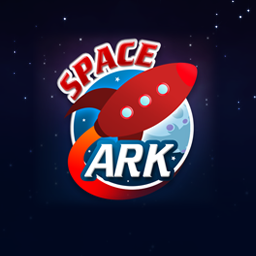
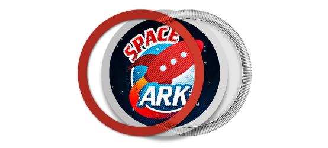

.. _turbulenz_services_assets:

=============================
The Turbulenz Services Assets
=============================

Badges, leaderboards and store items all require images in order to be published to turbulenz.com.
Each of these services require PNG images of 256x256 pixel size. The services support PNG images with transparency.

.. _turbulenz_services_images_leaderboards:
.. _turbulenz_services_images_store:

Leaderboards and Store Icons
----------------------------

:ref:`Leaderboards <leaderboardmanager>` and :ref:`Store <storemanager>`
icons are commonly rendered on Turbulenz sites, in emails and social networks at 32, 48, 56, 80 and 256 pixels square.
You are only required to provide the images in 256x256 pixels.
Any of the other resolutions will be automatically generated by resizing from the 256x256 image.
However, for better low resolution quality you can also provide the images at 32x32 and 48x48 pixels explicitly.

For example:

.. figure:: img/rocket256.png
    :scale: 100 %
    :align: center

:ref:`Leaderboard <leaderboardsyaml_icon256>`/:ref:`Store <storeyaml_icon256>` icon 256x256 pixels.
This image size must be provided in order to deploy your game to turbulenz.com.

:ref:`Leaderboard <leaderboardsyaml_icon48>`/:ref:`Store <storeyaml_icon48>` icon 48x48 pixels.
This is optional but recommended as automatic resizing of the 256x256 pixel image might not give aesthetically pleasing results.

.. figure:: img/rocket32.png
    :scale: 100 %
    :align: center

:ref:`Leaderboard <leaderboardsyaml_icon32>`/:ref:`Store <storeyaml_icon32>` icon 32x32 pixels.
This is optional but recommended as automatic resizing of the 256x256 pixel image might not give aesthetically pleasing results.

The Store and Leaderboard icons are not processed in anyway after they are resized.

.. _turbulenz_services_images_badges:

Badges Icons
------------

Badges are different to the :ref:`Leaderboards <turbulenz_services_images_leaderboards>` and :ref:`Store <turbulenz_services_images_store>`
icons as they are required to fit a pre-defined aesthetic structure.
Badges icons are commonly rendered on Turbulenz sites, in emails and social networks at 32, 48, 56, 80 and 256 pixels square.
Unlike leaderboards and store icons, badges icons can only be given as 256x256 pixels.

**Processing**

Badges are taken as a 256x256 pixel image.
For example:

The image size must be 256x256 in order to deploy your game to the Gamesite.
See the :ref:`badges.yaml <badges_yaml>` definition for information on how to set the badge icon.
When your image is uploaded to the Hub it will be processed to make it fit a pre-defined aesthetic structure.
These are the steps taken to convert your asset into the correct structure.

- Your image will be masked depending on the badge type.
  There are 2 types of badges: circle and diamond.
  For more information on the badge types see the :ref:`badges.yaml <badges_yaml>` definition.

  .. image:: img/badge_mask_circle.png
      :scale: 100 %
  .. image:: img/mask_circle.png
      :scale: 100 %

  Left: Area masked for circular badges.
  Right: Badge circular mask 256x256 pixels.

  .. image:: img/badge_mask_diamond.png
      :scale: 100 %
  .. image:: img/mask_diamond.png
      :scale: 100 %

  Left: Area masked for diamond badges.
  Right: Badge diamond mask 256x256 pixels.

  .. NOTE::
      The visible area is **not** vertically centered.

  So the above example as a circle badge, once masked, looks like this:

  .. figure:: img/masked.png
      :scale: 100 %
      :align: center

- Next a :ref:`textured border <badge_yaml_bordercolor>` is applied in the hexadecimal CSS color code you specify.

  .. figure:: img/badge_anatomy1.png
      :scale: 100 %
      :align: center

      The badge image and border hexadecimal CSS color code are required.

- Finally, the icon is resized to 32, 48 and 256 pixels square.

**Badge Visual Anatomy**

There is a 3 step composition process for a badge graphic:

- **Diffuse Pass** (Colored border) – this is the border surrounding the badge image.
  Developers must pick an hexadecimal CSS color code for this to compliment the badge image.
- **Badge image** – this is the main image of the badge encapsulated by the border.
  Developers must submit an image to fill this space.
- **Detail Pass** (Thread pattern overlay) – The thread pattern overlay (alpha PNG) is composited over the first two layers to create the final badge.

    Exploded view of the composition steps.

**Left:** Border in specified hexadecimal CSS color code.
**Center:** Input image after mask in 256x256 pixels.
**Right:** Thread pattern overlay.